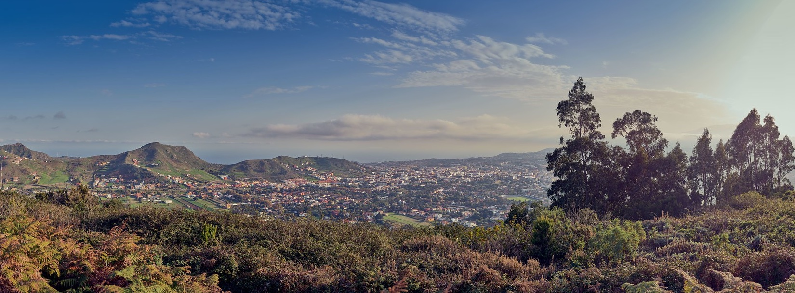

# 2021 Summer Camp

**We are launching our second summer camp for inquisitive minds aged 3 to 12, from the 24th of June till the 30th of July 2021**. Our facilitators \(who are trained teachers with experience in active learning\) will be guiding this activity from Monday to Friday, 8.30am to 3pm.

**Our ratios will be a maximum of 8-10 children per adult.**


To sign up please complete the [Registration Form](https://docs.google.com/forms/d/e/1FAIpQLSeFAo_8aznvGCkYuR6QEmotzltKD3etWGdA4gh7goFRjVAevw/viewform?usp=sf_link)


## Activities and Philosophy

Our facilitators **respect children's individual rhythms and motivations** and develop activities that promote **social and emotional learning**, as well as **psychomotor development**, **autonomy, creativity, free play** and **collaboration**. These are some of the activities we offer: 

* wildlife observation
* storytelling
* land art
* collaborative games
* open air painting
* crafts using elements from nature and loose parts 

## Meeting Point

We will be meeting you at the school, located on 11 Camino Fuente Cañizares in La Laguna \(see map below\). We will also be doing activities such as cycling in Mesa Mota \(a flat-topped mountain with a laurel forest\).

{% embed url="https://www.google.com/maps/d/u/0/viewer?mid=1XOztYHnPHX5yWgs-mnfy4eyjUDIXh4I0&ll=28.491020002799928%2C-16.319945000000008&z=16" caption="Kaleide International School location" %}

## Prices

**Please find the fares at the table below. All prices are subject to local 7% IGIC tax.**

| Attendance times | Weekly | Daily |
| :--- | :--- | :--- |
| 9.00am-1.30pm | €95 | €20 |
| 8.30am-3.00pm | €115 | €25 |

This does not include breakfast, snacks or lunch, which need to be brought from home. You are requested to pay for the total number days your child is coming, and this should be done in the first week of attendance. Unfortunately we are unable to reimburse you if your child does not come on the scheduled days.

## What the children need to bring

It's important for your child to bring:

* a nutritious and delicious lunch
* extra snacks
* a refillable water bottle \(no disposable plastic please\)
* closed-toe shoes \(to prevent soil and pebbles from getting inside\).
* comfortable clothes that can get dirty
* a cap
* extra underwear and trousers/shorts for the younger children \(3-5\)
* sunscreen already applied for the day \(send extra if your child has sensitive skin\)
* face mask \(only for children six years of age or older\)

## Health and Safety measures

Each facilitator will bring hand sanitizer and a bottle with soapy water. We will also have a first-aid kit with us, as well as bags for waste disposal. 

We have civil liability and accidents insurance, and our facilitators have First Aid training.

I relation to COVID-19 prevention measures, all families taking part in the summer camp must read and accept our [COVID-19 protocol](covid-19-prevention-protocol.md) before joining us.


To sign up please complete the [Registration Form](https://docs.google.com/forms/d/e/1FAIpQLSeFAo_8aznvGCkYuR6QEmotzltKD3etWGdA4gh7goFRjVAevw/viewform?usp=sf_link)


