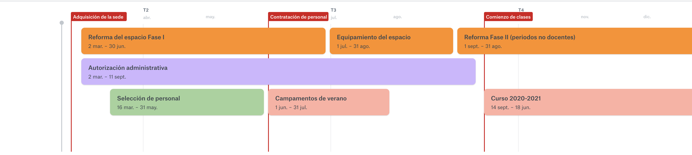

# Kaleide International School \(KIS\)


Toda la información aquí presentada es a título informativo, es susceptible de cambios y carece de valor contractual, por lo que no podemos asumir responsabilidades derivadas de esta información.


## PRESENTACIÓN

Kaleide International School \(KIS\), una escuela privada extranjera \(Británica y Estadounidense\), es un pequeño proyecto educativo emergente de educación activa para niñas y niños de entre 3 y 12 años de edad, basado en los principios de aprendizaje activo y vivencial y de educación democrática. El nombre “Kaleide” es un neologismo griego derivado de las palabras καλός \(kalos\), “bello”, y εἶδος \(eidos\), “forma, figura”. Se podría decir que su significado literal es “formas bellas”, como las que caprichosamente se ordenan en el interior de un caleidoscopio para crear estructuras siempre cambiantes e inspiradoras. Es desde esta mirada que aprecia la belleza de la individualidad al mismo tiempo que la de la colectividad, como queremos acercarnos a cada una de las personas, grandes y pequeñas, que participen en nuestro espacio.  
Los promotores somos una madre y un padre \(Diana y Diego\) que hace tiempo descubrimos que, en educación, se pueden hacer las cosas de forma mucho más humana. Nuestra investigación, que hemos plasmado en un [blog](http://www.estonoesunaescuela.org), y un documental que muy pronto verá la luz, nos ha llevado a visitar y conocer muchos proyectos educativos en España y en el extranjero, y a conectar con decenas de personas implicadas en un cambio educativo. En la medida de lo posible, hemos ido difundiendo nuestras reflexiones en torno a la educación a través de nuestra web, medios de comunicación y redes sociales. Tras nuestra experiencia en los mundos virtuales de las redes sociales y el audiovisual, hemos sentido la necesidad de impulsar la creación de Kaleide International School donde pretendemos condensar, en un espacio tangible, todos nuestros aprendizajes.


Si tienes más dudas, escríbenos a [kaleideschool@gmail.com](mailto:kaleideschool@gmail.com) o únete a nuestro canal público de [Telegram](%20https://t.me/kaleide).


## LOCALIZACIÓN E INSTALACIONES

Contamos con una parcela en propiedad de casi 3000 m2 de superficie sin desniveles, ubicada en una tranquila zona residencial de San Cristóbal de La Laguna. A escasos metros del estadio Francisco Peraza, y apenas a 15’ caminando el centro histórico de La Laguna, ciudad Patrimonio Histórico de la Humanidad. A 30’ de caminata se alcanzan algunos bosques locales de flora autóctona, y alrededor de la finca todavía existen espacios rurales y de cultivo. El 80% de la parcela es espacio libre en exterior, uno de los ambientes de aprendizaje más importantes, sobre todo a edades tempranas. De forma progresiva iremos complementando la vegetación existente con más plantas y árboles adecuados a las características de la vega lagunera.



Nuestras instalaciones suman entre sus dos plantas cerca de 650 m2. Durante la reforma integral del edificio, que se realizará en dos fases, se cuidará el carácter sostenible de las intervenciones. Aspiramos a reducir el impacto ambiental del funcionamiento del edificio mediante el reciclado de aguas grises, la captación de agua de lluvia, el reciclado de residuos y el uso de energías renovables para su abastecimiento.

Dentro del edificio existen ambientes diferenciados para actividades sociales e individuales, más activas o más tranquilas, y espacios dedicados para la expresión corporal, musical y plástica, la fabricación, la cocina y la experimentación.

Para aquellas actividades deportivas que no puedan realizarse en nuestro espacio, aspiramos a establecer un convenio con el Organismo Autónomo de Deportes de La Laguna que nos permita el uso de las instalaciones deportivas cercanas, tales como las del estadio Francisco Peraza, las del Complejo deportivo de San Benito o la pista BTT y rocódromo del parque de La Vega.


KIS cuenta con una localización estable, instalaciones accesibles y seguras, y además promueve un modelo de gestión y movilidad sostenible, minimizando el impacto ambiental de sus operaciones.


## HOJA DE RUTA

Nuestro proyecto es de nueva implantación. De alguna forma, quienes participen este primer año van a conocer y acompañar durante sus primeros pasos a una criatura recién nacida. Iniciaremos la actividad docente en septiembre de 2020, previa adecuación del espacio para atender los requisitos obligatorios de seguridad, salubridad, habitabilidad y accesibilidad \(Fase I de la intervención\), y al mismo tiempo obtener todas las autorizaciones de las administraciones locales y de la Consejería de Educación del Gobierno de Canarias.

Para facilitar la convivencia de grandes, pequeños, familias y docentes durante este primer curso escolar \(2020-2021\) hemos decidido reducir la capacidad efectiva del centro a un máximo de 12 alumnos de infantil y de 14 en primaria. Esto nos permitirá atender, de forma mucho más personalizada y a escala más humana, todas las cuestiones que se vayan planteando durante este primer año, al mismo tiempo que consolidamos un equipo de trabajo y un grupo de familias, y se van creando de forma orgánica estructuras relacionales sostenibles. Durante este primer curso sólo ocuparemos la primera planta del edificio.

Para el curso 2021-2022 se terminarán las obras de adecuación de todo el edificio \(Fase II\) y ocuparemos su totalidad, disponiendo de más espacios y materiales, además de más capacidad de alumnado. En función de la demanda para estudios de secundaria que se hubiese generado durante el curso anterior, podríamos plantear la opción de ofrecer secundaria ese mismo curso o bien esperar al año siguiente para hacerlo.


Es nuestra firme voluntad cumplir con las fechas y plazos indicados, aunque no nos es posible garantizarlos al depender muchos de ellos de terceras partes sobre las que no tenemos control.


## PEDAGOGÍA

Kaleide quiere ser una escuela donde:

* se valoran las relaciones de cuidado basadas en la confianza;
* se escuchan y tienen en cuenta las voces de los niños y niñas;
* hay continuidad entre la familia, la escuela y la sociedad;
* se fomenta un entorno libre de juicio, sin premios ni castigos;
* se respetan los ritmos individuales de cada niño y niña;
* se inspira el asombro, la curiosidad, la investigación, la experimentación, la solución de problemas, la creatividad y la colaboración;
* se fomentan la motivación intrínseca y la autonomía, junto con el pensamiento
* divergente, la conciencia emocional y el desarrollo de competencias;
* se alimenta la conexión de los niños y niñas con la naturaleza;
* se promueve la libertad responsable de los niños y niños, y su participación en la toma de decisiones.

El cuidado y el aprendizaje forman un todo en Kaleide, porque entendemos que la educación se construye sobre una interacción \(entre todas las personas que formamos la comunidad educativa\) basada en el cuidado. Nuestro deseo es que estos lazos de cuidado se extiendan al mundo de las ideas, al mundo humano y al mundo natural.  
Seguimos un currículum que está basado en el currículum británico en cuanto a contenidos. Pero el currículum no es solo qué aprenden los niños y niñas, sino sobre todo cómo aprenden. En Kaleide trabajamos desde un “currículum emergente” que toma la forma de aprender y las motivaciones e inquietudes de los niños y niñas como punto de partida.

  
En Kaleide, los niños y niñas podrán participar en diversas actividades:

* aprendizaje interdisciplinar basado en proyectos;
* talleres vivenciales \(impartidos por facilitadoras, niños o expertas\);
* clases impartidas por una persona adulta;
* aprendizaje en espacios abiertos \(jardines de la escuela, salidas al campo y la playa, visitas a la biblioteca y los museos de La Laguna\);

Cada niño y niña tendrá la oportunidad de diseñar su propio itinerario de aprendizaje en colaboración con el equipo pedagógico, eligiendo y proponiendo actividades que se ajusten a sus motivaciones, sus habilidades y su nivel de desarrollo.

## HORARIOS

El horario docente propuesto para el primer año de funcionamiento es **de 8:30h a 13:30h**. Existe servicio de atención a la comida hasta las 14:00h \(14:30 si fuera preciso establecer dos turnos\), que está incluido en la cuota docente, pero que no incluye comida. Durante el primer curso y hasta que tengamos capacidad de operar un comedor propio, existirá la posibilidad de traer la comida de casa o bien contratar un servicio de pago de catering.

Se ofrece un periodo de **atención temprana desde las 8:00h,** y de **permanencia hasta las 16:00h** para aquellas familias que lo requieran, aunque este servicio no está incluido en la cuota docente.

Las puertas se abrirán en un primer periodo, entre las 8:20 y 8:30, para realizar una entrada relajada al centro. En caso de no poder acudir en ese horario, se volverán a abrir entre las 8:50 y las 8:55. Por último, existirá un periodo adicional de 9:20 a 9:25 pero solo bajo solicitud previa. Cualquier otra circunstancia que obligue a la entrada en un horario diferente a los indicados, debe ser autorizada por la dirección del centro.

Por último, estas horas son las propuestas. **El horario docente definitivo será decidido en colaboración con las familias que se matriculen durante el primer periodo** \(febrero 2020\), por lo que es posible que se adelante o retrase media hora, pudiendo comenzar por ejemplo a las 8:00, a las 8:30 o a las 9:00, en función de lo que decida la mayoría, desplazando en la misma medida al resto de horarios aquí indicados. Se mantendrá, no obstante, la duración de la jornada en 5h docentes, por motivos de convenio laboral.











## PRECIOS


Las condiciones económicas para el primer curso son más ventajosas que para cursos sucesivos. 


Nuestra política de precios incluye varios conceptos. Aquí tienes una descripción de los fundamentales para que no te pierdas al leer la tabla que adjuntamos más abajo:




Los depósitos solo será posible suscribirlos durante el primer año de funcionamiento de KIS.



Los depósitos no son obligatorios, sino **voluntarios y reembolsables**, pero **sirven para reducir la cuota**.


Este año ofrecemos la posibilidad de realizar una aportación única por familia, reembolsable, y por un importe de **3000 €**. A cambio, te ofrecemos una reducción de las cuotas de facilitación. Este importe se **devuelve transcurrido un plazo mínimo de tres años**, consolidando a partir de ese momento los descuentos recibidos y garantizando la congelación de las cuotas para los años siguientes, salvo la corrección debida al IPC. 

El depósito **se puede recuperar antes de que se cumplan los tres años**, pero entonces **se perderán los descuentos acumulados** que se restarán del importe del depósito en su devolución, perdiendo también la posibilidad de congelar las tarifas posteriores.

 El plazo para aportar el depósito comienza el 1 de septiembre de 2020, y se deberá haber aportado un 50% del importe antes del comienzo de las clases. Para el día 18 de diciembre de 2020 se deberá haber haber completado el 100% del depósito.


**El descuento** en cuotas de facilitación que se obtiene por realizar un depósito **supera el rendimiento del mismo importe en una cuenta corriente** a la vista.





Si realizas la matriculación en el primer periodo no pones en riesgo tu dinero, ya que sólo tendrás que acudir a la visita que concertemos antes del verano para poder solicitar su devolución.


Este importe **solo se abona una vez por cada alumno**, en concepto de apertura de expediente y proceso de admisión al centro. En caso de que el alumno curse baja en el centro y vuelva a cursar alta transcurrido más de un curso académico completo, se deberá volver a abonar este concepto. 

Existen dos periodos para realizar la primera matriculación:

* **Primer periodo**: Entre finales de febrero y la primera semana de marzo. El importe es de 250 € y es reembolsable. Antes del verano \(mayo-junio\) se realizará una visita a las instalaciones y se facilitará información detallada sobre el cumplimiento de la hoja de ruta, el personal contratado, etc. En ese momento se ofrecerá la posibilidad de continuar en el proyecto o no. En caso de no querer continuar, se devolverá el importe íntegro de la matrícula.
* **Segundo periodo**: Antes del verano \(mayo-junio\), por un importe de 350 € y sin posibilidad de reembolso.




Los gastos de materiales se desgravan del I.R.P.F. por un importe anual de hasta 100 €.


Esta cuota anual sirve para cubrir los gastos de materiales y consumibles de las actividades pedagógicas. El importe estimado inicialmente es de 150 € por niño, y está sujeto a revisión anual. Si a la finalización del curso escolar se rebasara esta previsión, sería necesario complementar el importe.




En caso de que se haya realizado un depósito, el curso es gratuito.


Todas las familias que acudan a KIS por primera vez, deben hacer un curso de formación. En el se les explicará en detalle todo lo relativo a:

* las normas básicas de permanencia en el centro;
* las actitudes y estrategias relacionales con el personal y el resto de participantes \(niñas y niños\);
* las cuestiones básicas de seguridad y autoprotección;
* las políticas del centro \(resolución de conflictos, antibullying, bienestar infantil, comunicación interna, etc.\);
* la asociación de madres y padres;
* el proyecto pedagógico y las normas de convivencia;
* etc.

Procuraremos que sea más bien una fiesta que un aburrido curso de formación, pero es indispensable que las familias pasen por este proceso. El curso de formación lleva asociado un coste de 95 € por familia, que no es necesario abonar si se ha optado por realizar un depósito.



Como garantía de pago y para hacer frente a cualquier saldo deudor, es necesario depositar una fianza al comienzo de cada curso. **El importe varía en función del número de niños por familia**, como se puede observar en la tabla de tarifas que se incluye más abajo. 

En caso de impago de alguna cuota, se tratará con los afectados la solución a adoptar, aunque **la condición para poder seguir acudiendo al centro es no tener saldo deudor** con el mismo. La fianza se puede devolver al finalizar el curso o, si se va a continuar en el centro, dejarla en depósito para cursos posteriores, debiendo actualizar el importe si hubieran variaciones al alza del IPC.




**Las cuotas** docentes nominales \(nosotras las llamamos de "facilitación"\) **van reduciéndose** con el tiempo **conforme aumenta la antigüedad del menor en el centro.**



**En caso de haber realizado un depósito, sucede a la inversa**, las cuotas van incrementándose durante tres años hasta congelarse en el cuarto año.


Esta **es la cuota que da acceso a los servicios docentes** y, para el ciclo de primaria, tiene la peculiaridad de ser decreciente a lo largo del tiempo \(salvo en caso de haber realizado un depósito, que es a la inversa\).

Ofrecemos  dos formas de pago:

* **Pago por adelantado por el importe total:** Se bonifica con un descuento adicional del 5% sobre la tarifa anual. 
* **Pago por mensualidades:** No tiene descuento. Nuestra propuesta es realizar 10 pagos mensuales, siendo el primero a comienzos de septiembre y los posteriores al comienzo de cada mes. No obstante, podemos acordar individualmente con cada familia otras formas de pago que puedan ser más fáciles de asumir, con la única condición de no incurrir en saldos deudores.

Como se puede observar en la tabla, existen grandes diferencias entre los importes en caso de realizar un depósitos y en caso de no hacerlo.

Por último, además del descuento por pago único ya comentado más arriba, se ofrecen descuentos adicionales, acumulables, para las siguientes situaciones:

* **Descuento por hermanos:** cada hermana/o adicional verá su cuota reducida un 25%.
* **Descuento por familia monomaren\[paren\]tal:** para aquellas familias de una sola progenitora/tutora existe la posibilidad de un descuento equivalente al de hermanos desde el primer hijo. Para acceder a este descuento, es necesario demostrar también unos ingresos familiares inferiores a un umbral determinado.


En la tabla que adjuntamos más abajo, el concepto "Año I", "Año II", etc. se refiere a los años que lleva el menor en el centro, no al curso que le corresponde por edad.




Además de estos conceptos básicos, para aquellas familias que lo requieran, ofrecemos servicios adicionales que se abonan aparte:



Cubre la atención del menor durante media hora antes de la apertura del centro. Esta tarifa puede ser abonada de forma regular \(mensualmente\) o bien puntual, por días concretos.



Cubre la atención del menor hasta dos horas después del cierre del centro. Esta tarifa puede ser abonada de forma regular \(mensualmente\) o bien puntual, por días concretos.



**La atención a la comida está cubierta por el horario escolar**, pero no lo está la comida propiamente dicha, que puede ser traída de casa o bien adquirida en el centro mediante un servicio de catering. Se podrá abonar de forma puntual o mensual.


Los valores indicados en la tabla que se adjunta más abajo son estimativos. Todavía no contamos con presupuestos reales sobre los costes del catering.




En la siguiente tabla se pueden observar las tarifas nominales y las tarifas aportando el depósito. En cada escenario figuran los importes correspondientes para cada uno de los conceptos arriba indicados, según el número de hermanos y según la condición de que sean dos progenitores o un único progenitor. 

A modo de ejemplo, para que se entienda mejor, se han marcado a color dos escenarios diferentes:

* **Verde:**
  * familia monomarental;
  * un solo hijo en el ciclo de infantil;
  * abona la primera matriculación en junio;
  * abona las cuotas de facilitación en 10 mensualidades**.**
* **Rojo**: 
  * familia de dos progenitores \(pluriparental\);
  * dos hijas en el ciclo de primaria;
  * realizan un depósito;
  * abonan la primera matriculación en febrero;
  * abonan de un solo pago la cuota de facilitación.




Todos los importes indicados se verán corregidos anualmente en caso de subidas del IPC.


## PREGUNTAS FRECUENTES


Anímate a enviarnos tus dudas a [kaleideschool@gmail.com](mailto:kaleideschool@gmail.com) para que podamos seguir completando esta sección.


### ¿Por qué decís que KIS es una escuela internacional?

**Por dos razones**, una organizativa y otra filosófica. 

La **razón organizativa** se debe a que, para poder aplicar nuestra visión pedagógica, necesitamos autorizarnos como escuela extranjera. Y no solo con un país, sino con dos: Reino Unido y Estados Unidos, de ahí lo de “internacional”. 

La **razón filosófica** se explica porque aspiramos a que KIS sea un punto de encuentro multicultural, donde se escuchen conversaciones en diferentes idiomas y que se impregne de una visión más poliédrica y enriquecedora del mundo.

### ¿Los estudios se convalidan? ¿Se obtiene algún título?¿Cómo pasa el alumno a secundaria?

Dado que no existe titulación para segundo ciclo de infantil ni para primaria, **no existe necesidad de convalidar estudios.** En secundaria, sin embargo, sí existe título, y cuando ofertemos este ciclo se realizará un **proceso de homologación de estudios para que las alumnas y alumnos de secundaria tengan reconocido su título en España, Inglaterra y/o Estados Unidos**. 

**El tránsito de un alumno al sistema educativo español**, bien porque haya acabado sus estudios en KIS, o los haya abandonado antes de finalizar algún ciclo, **es automático**, tal y como se indica en la página web del Ministerio de Educación y Formación Profesional, tanto para [primaria](http://www.educacionyfp.gob.es/contenidos/estudiantes/educacion-primaria/informacion-general/requisitos-de-acceso.html) como para [secundaria](http://www.educacionyfp.gob.es/contenidos/estudiantes/educacion-secundaria/informacion-general/requisitos-de-acceso.html):

  
_La incorporación a cualquiera de los cursos que integran la Educación \[Primaria/Secundaria Obligatoria\] del alumnado procedente de sistemas educativos extranjeros que esté en edad de escolarización obligatoria se realizará atendiendo a sus circunstancias, conocimientos, edad e historial académico, para que pueda continuar con aprovechamiento su educación._

### ¿En qué se diferencia el sistema educativo británico del español?

 Además de lo obvio, que es el idioma, existen algunas diferencias importantes entre ambos sistemas. La que más puede afectar desde el punto de la planificación, es la referente a los ciclos educativos, ya que **el equivalente a primaria comienza y finaliza un año antes que en España**. En la siguiente tabla se estable la correspondencia entre ambos sistemas: 

| Edad | Español | Británico |
| :--- | :--- | :--- |
| 3 | 2º Ciclo de infantil  | Early Years - Nursery |
| 4 | 2º Ciclo de infantil | Early Years - Reception |
| 5 | 2º Ciclo de infantil | Key Stage I - Year 1 |
| 6 | 1º de primaria | Key Stage I - Year 2 |
| 7 | 2º de primaria | Key Stage I - Year 3 |
| 8 | 3º de primaria | Key Stage II - Year 4 |
| 9 | 4º de primaria | Key Stage II - Year 5 |
| 10 | 5º de primaria | Key Stage II - Year 6 |
| 11 | 6º de primaria | -- |

### He oido que queréis hacer una cooperativa pero, ¿no se corre el riesgo de que se pierda vuestra visión y KIS se convierta en algo completamente diferente a lo que ahora se ofrece?

Desde nuestro punto de vista, **ese riesgo es mínimo**. Durante las charlas informativas hemos indicado que uno de nuestros objetivos a largo plazo es cooperativizar KIS. Dado que el proyecto carece de ánimo de lucro \(aunque es crucial que sea viable económicamente\) y que tiene una dimensión social, creemos que la persona jurídica que mejor encarnaría este tipo de gestión sería una cooperativa. Además, a muy largo plazo, sería una forma de garantizar la supervivencia del proyecto, ya que el liderazgo dejaría de ser de tipo personalista.

No obstante, somos conscientes de las dificultades y los riesgos que entraña la puesta en marcha de una cooperativa. Por eso, nuestra propuesta es conservadora en ese sentido. Inicialmente, KIS funcionará con un modelo de gestión privada y dirigida por nosotros. Estableceremos mecanismos para recoger sugerencias y propuestas, por lo que desde el principio existirá la posibilidad de participación en el proyecto, tanto por el personal docente como por las familias y niños, aunque siempre sujeta a la aprobación por la dirección del centro. 

Mientras tanto, iremos ensayando diferentes modelos de gobernanza que vayan implicando a aquellas personas que voluntariamente se presten. Si de esos ensayos recibimos una **clara señal de que hay interés en cooperativizar KIS**, si además existe un **claro consenso entre todos los participantes** para que se de este paso, y si **se equipara el riesgo asumido por todos los cooperativistas y el grado de inversión** personal**,** material  y económica en el proyecto, se dará el paso para cooperativizar KIS. 

### ¿Va a haber una ruta escolar? ¿Se puede aparcar cerca del espacio? ¿Cómo es el acceso?

**Sí, si hay un número suficiente de personas interesadas.**

Para nosotras, el tema de la movilidad sostenible es importante. Por eso queremos fomentar modelos de movilidad que impliquen un menor uso del vehículo privado, alentando el del transporte colectivo, de vehículos personales como la bicicleta o el patinete y, fundamentalmente, caminar.  Por esta razón, KIS no cuenta con zona de aparcamiento para vehículos en sus instalaciones ni se permite la circulación de vehículos a motor en su interior. No obstante, **se encuentra en una zona de fácil acceso** en vehículo desde la vía de ronda, con una zona pública de aparcamiento frente al estadio Francisco Peraza, a escasos 5 minutos caminando; a 22 minutos de paseo desde la parada de La Trinidad del tranvía, y a 8 minutos de la parada de guaguas más cercana.

  
Desde la dirección de la escuela y con la colaboración de la asociación de madres y padres, otros colectivos sociales, escuelas cercanas, el Ayuntamiento de La Laguna y la Dirección General de Tráfico, trataremos de fomentar la creación de caminos escolares seguros, tipo “pedibus” o “bicibus” desde los principales puntos de recalada, tales como la parada del tranvía o el parking público del Francisco Peraza. Estos caminos tienen el objetivo de recuperar el espacio público para las niñas y niños, fomentar su salud, su conocimiento del medio, su capacidad de orientación, su autonomía y autoestima, al tiempo que promovemos una movilidad más sostenible para todas. En esos recorridos, los niños podrán acceder por sus propios medios al centro, acompañados por su personal, voluntarios de la asociación de madres y padres, o de otros colectivos e instituciones. Y, como proyecto, nos encantaría en algún momento ver algo así por las calles de La Laguna.



Mientras construimos nuestro bicibus, si existe un número suficiente de personas interesadas en un transporte colectivo privado, se ofrecerá la posibilidad, repercutiendo el coste adicional entre sus usuarios.

### ¿Hay más proyectos en España como este?

**Sí, pero pocos.** En España no hay muchos proyectos con una visión similar a KIS que se encuentren autorizados por las administraciones educativas. Es muy complicado conseguir reunir todos los requisitos financieros, legales, pedagógicos y de espacio que se exigen para la creación de un centro educativo de estas características. No obstante, sí que existen algunos centros similares y en los últimos años, se están creando cada vez más centros educativos basados en pedagogías activas. La tendencia al alza en la creación de estos espacios no es única en España, sino que se da a nivel internacional. Desde KIS, estamos tendiendo lazos con todos aquellos movimientos pedagógicos más alineados con nuestra filosofía y pretendemos ser un nodo activo en gran parte de ellos. Desde el grupo de escuelas [NEASC](https://www.neasc.org/) que ya existe en España, hasta la Red de Centros de Aprendizaje Ágil \([ALC](https://agilelearningcenters.org/centros-de-aprendizaje-agil-2/)\), pasando por la Comunidad de Educación Democrática Europea \([EUDEC](https://eudec.org/)\) o la Alianza por la Educación Auto-dirigida \([ASDE](https://www.self-directed.org/)\).

### ¿Cómo es el proceso de admisión?

Durante este primer año, el proceso se realizará atendiendo a los siguientes requisitos:

* Para **infantil**:
  * Niñas/os que cumplan al menos tres años de edad y menos de cinco en 2020 y que no requieran atención especial \(\*\).
* Para **primaria**
  * Niñas/os que cumplan al menos seis años de edad y menos de once en 2020 y que no requieran atención especial \(\*\).
* **Comunes**:
  * Haber abonado el importe de **primera matriculación** en cualquiera de los dos periodos establecidos \(si quedan plazas disponibles también es posible hacerlo más tarde, por el importe de cuota estándar\). 
  * Acudir a una **entrevista personal** con madres/padres/tutores legales con y sin niñas/os a fin de comprobar el grado de afinidad entre ambas partes. De estas entrevistas se tomará la decisión de admitir o no al menor.
  * En caso de ser admitido:
    * abonar los **importes correspondientes a la fianza, materiales y curso de formación** en las fechas correspondientes;
    * **realizar el curso de formación** inicial para familias en alguna de las fechas acordadas.

Una vez haya finalizado el proceso de admisión, se propondrá un calendario escalonado de incorporación al centro consensuado con cada familia.

### ¿Se tiene en cuenta que haya otros hermanos para dar preferencia en la lista de espera?

**Sí.** El hecho de que un/a niño/a ya tenga un/a hermano/a en el centro le da preferencia para su admisión.

### ¿Las familias pueden estar en el espacio?

**Sí y no.** El periodo de adaptación no es fijo, sino flexible y personalizado, en función de las necesidades que tengan las familias y, sobre todo, los niños. El espacio no cuenta con una estancia específica y separada para la permanencia de las familias, por lo que es imprescindible que las personas que vayan a acompañar a sus hijas durante este periodo hayan realizado el curso de formación inicial para familias. 

Una vez finalizado el periodo de adaptación se admitirá, siempre que sea de forma justificada y bajo la autorización previa de la dirección del centro, la presencia en el espacio de aquellas familias que lo soliciten . En estos casos, las familias deberán respetar en todo momento las normas de convivencia y no interferir con las dinámicas del centro.

En cualquier caso, por cuestiones de legalidad, cualquier persona que vaya a tener un contacto regular con menores deberá aportar un certificado negativo de delitos sexuales reciente para ser admitido al espacio. Entendemos que el contacto es regular si el tiempo de permanencia en el espacio es igual o superior al 50% del tiempo docente semanal. 

### ¿Hay tarifas especiales para familias con varios hermanos?¿Y de un solo progenitor?

**Sí.** Cada hermano adicional cuenta con un **25% de descuento** en la cuota de facilitación.

Las tarifas de un solo progenitor se equiparan al descuento por hermanos desde el primer hijo. Para acceder a estas tarifas es necesario encontrarse en alguna de estas situaciones, que deberán ser acreditadas mediante libro de familia, certificado del registro civil, certificado de viudedad, etc.:

* Ser viuda y/o viudo;
* Afrontan la maternidad a solas, ya sea con un embarazo natural o por reproducción asistida;
* Adoptar en solitario.

Además, será requisito adicional demostrar ingresos en la unidad familiar inferiores al 250% del Indicador Público de Renta de Efectos Múltiples \(IPREM\).

### ¿Se van a dar becas?

Nos encantaría  poder facilitar el acceso a Kaleide a todo el mundo, independientemente de su poder adquisitivo. No obstante, actualmente nos es imposible hacer frente a los gastos de operación del centro sin que todos los asistentes abonen sus cuotas, así que **no podemos ofrecer becas**.

No obstante, una vez el centro esté en funcionamiento, nuestra pretensión es crear una fundación Kaleide que se encargue de difundir esta visión pedagógica, prestar servicios relacionados con ella y obtener fondos que puedan permitir la creación de becas al estudio.

### ¿Se pueden pagar los días de permanencia y acogida temprana por días sueltos?

**Sí,** existe una tarifa por días sueltos, aunque es preciso avisar con al menos un día de antelación.

### ¿Qué sucede si saco a mi hijo del espacio? ¿Puedo seguir haciendo homeschooling?

Desde KIS creemos que la escolarización en casa y la desescolarización conscientes deberían ser una opción más del sistema educativo y estar convenientemente reguladas. No obstante, es importante indicar que KIS será un centro autorizado por la Consejería de Educación del Gobierno de Canarias, y por tanto, sujeto a control administrativo. Por ejemplo, las altas de alumnos y docentes en el centro deben ser notificadas a la Consejería, y cada niño recibirá un código alfanumérico que lo identifica ante la administración \(CIAL\). **Una vez que se curse una baja,** también **estamos obligados a notificarla a la Consejería.**

### ¿Se puede acudir al espacio por días o semanas sueltas?

En Estados Unidos y otros países, existen centros para personas no escolarizadas que funcionan como “bibliotecas” donde no solo se pueden encontrar libros, sino también materiales de aprendizaje y personas dispuestas a compartir sus conocimientos. A estos centros se puede acudir cuando se desee, sin que se exija un nivel de asistencia determinado. 

Nos gusta imaginar un sistema educativo tan avanzado y nos encantaría que KIS pudiera convertirse en un espacio así. Sin embargo, en España la Ley no permite hacer esto. Las niñas y niños que acudan a nuestro centro lo hacen en calidad de alumnos escolarizados, y por lo tanto están sujetos a cumplir un nivel mínimo de asistencia. Además, por cuestiones de viabilidad económica del proyecto, de vinculación con el espacio y de creación de una cultura común, **no podemos ofrecer esta posibilidad**, por lo que solo podemos admitir niños y niñas que asistan por cursos completos.

### ¿Cuál es vuestro criterio en temas como las vacunas, por ejemplo?

Desde KIS respetamos el marco legal actual en cuestiones de salud, como la vacunación. A fecha de hoy en España **no existe obligatoriedad de someter a vacunación a ninguna persona** por lo que en nuestro centro no nos sentimos legitimados para exigir que las niñas y niños estén vacunados. No obstante, el bienestar infantil individual y colectivo es algo que nos preocupa y que tratamos de fomentar ejemplificando formas saludables de relación, alimentación e interacción con el mundo. Y creemos que eso incluye la inmunidad grupal, por ejemplo.

Para preservar la salud grupal no podemos admitir en el centro a personas que se encuentren en una fase claramente contagiosa de una enfermedad o que presenten síntomas evidentes de padecerla como, por ejemplo, fiebre.

### ¿Cuántos alumnos puede haber en Kaleide?

Aunque es un dato que no se puede confirmar aun –a la espera de lo que resuelva la Consejería de Educación en la autorización de centro– estimamos que el centro puede acoger **un máximo de 65 alumnos**: 25 en infantil y 40 en primaria, aproximadamente. Durante la primera fase del proyecto, el centro admitiría un máximo de 25 alumnos en infantil y 30 en primaria, aunque para facilitar una transición más asequible durante el primer año, limitaremos las plazas ofertadas a 12 en infantil y 14 en primaria.

### ¿Hace falta que los niños pequeños sepan ir solos al baño? ¿Vamos a tener que ir las familias a cambiarles?

**No.** En KIS respetamos los ciclos de cada niño y entendemos que cada persona tiene unas necesidades diferentes según su estado madurativo. Por eso, siempre que existan mudas disponibles en el centro para atender a un pequeño y contemos con la autorización de sus responsables, no será necesaria la presencia de estos para cambiarles.

No obstante, desde KIS aspiramos a promover la independencia y desarrollo pleno de los niños, y procuraremos facilitar esta transición trabajando mano a mano con cada niño o niña y cada familia. 

### ¿Cómo son los docentes en vuestro espacio?

Aunque en el momento de redactar este documento aún no tenemos personal seleccionado, los perfiles de nuestro equipo sí están claros. Siendo KIS un espacio que promueve el aprendizaje auto-dirigido, una cualidad que buscamos en nuestro personal docente \(nosotras lo llamamos “equipo de facilitación”\) es su auto-directividad. Además, tienen que ser personas con **pasión por su trabajo**, **capaces de conectar con los niños y entender \(y hablar\) todos sus lenguajes** \(corporal, plástico, musical…\), de ser un **ejemplo vivo de los valores del centro** \(empatía, colaboración y trabajo en equipo, sentido del humor, capacidad para jugar, ética del cuidado, honestidad y liderazgo\) y, ante todo, de disponer de una **gran dosis de humanidad.**

### ¿Existen notas o evaluaciones?

En KIS **no ponemos notas**, ni tampoco hay aprobados ni suspensos. Pero **sí llevamos a cabo evaluaciones** \(si bien muy diferentes de las que suelen hacerse en otros centros educativos\) con el objetivo de conocer a cada niño y niña, descubrir su potencial y contribuir a su desarrollo integral. Las evaluaciones nos sirven además para compartir con las familias, y con la comunidad, lo que se hace dentro de la escuela.

La evaluación se lleva a cabo paralelamente al proceso de aprendizaje, forma parte de él y es:

* formativa \(centrada en el proceso\);
* basada en dos ejes: bienestar emocional e implicación en la tarea;
* integral: incluye las dimensiones afectiva, física, cognitiva, social, y moral;
* no competitiva: no hay premios ni recompensas, juicios ni comparaciones;
* no basada en notas ni calificaciones \(apto/no apto\), sino en “historias de aprendizaje”;
* una herramienta que permite adecuar los espacios, recursos materiales y propuestas en función de las necesidades de los niños y niñas.

Utilizaremos diferentes medios de evaluación en función de la edad de los niños y niñas, y de las actividades en que participen:

* POMS \(Sistema de evaluación basado en el proceso, con dos ejes: bienestar emocional e implicación\);
* Documentación en forma de “historias de aprendizaje”: incluye fotos, dibujos y ejemplos del trabajo de los niños y niñas, transcripciones de sus frases y comentarios, ejemplos de interacciones y observaciones de las facilitadoras;
* Autoevaluación de los niños y niñas.

Estas evaluaciones se comparten con los niños y niñas, y se comunican a las familias en reuniones individuales.

La escuela sigue además un sistema de autoevaluación continuo basado en las aportaciones de niños y niñas, familias, y las propias observaciones del equipo. Esta autoevaluación toma en cuenta aspectos curriculares, la labor de las facilitadoras y el equipo directivo, así como las relaciones con niños y niñas y sus familias. Asumimos un compromiso de formación continua y reciclaje de todo el equipo pedagógico.

### ¿Qué les pasará a los niños que salgan de Kaleide y se incorporen al sistema convencional? ¿Se adaptarán?

En KIS vamos a poder conocer bien a cada niño y niña, y sabremos en qué nivel se encuentra en cuanto a conocimientos y destrezas. Esta información nos sirve también para saber si un niño o niña se encuentra al nivel de conocimientos que se establece para su edad dentro del sistema educativo. Dado que en KIS cada niño o niña aprende a su ritmo, antes de que uno de nuestros estudiantes se traslade a otro centro le ofreceremos \(en coordinación con su familia\) la posibilidad de reforzar sus conocimientos en determinadas áreas, en caso de haber detectado que se encuentra por debajo del nivel del curso que le corresponda.

Consideramos que las habilidades sociales, la inteligencia emocional y los valores que los niños y niñas van a adquirir en KIS les van a permitir enfrentarse a situaciones nuevas con un grado muy alto de flexibilidad y de autonomía. En nuestra experiencia, **la transición a un centro educativo más convencional no supone un problema**, siempre y cuando se haya incluido al niño o niña en la decisión y se le haya ofrecido la información necesaria.

### ¿Cómo se va a hacer el acompañamiento emocional si las facilitadoras no hablan español?

Si bien aún no podemos asegurar el nivel de español que tendrán las facilitadoras, en el espacio, en todo momento, habrá personas que hablen tanto inglés como español. De las cuatro facilitadoras que tenemos previsto contratar el primer año, una o dos serán españolas. Por otro lado, creemos que el elemento esencial para brindar apoyo emocional a los niños y niñas más pequeños no es el lenguaje verbal, sino el corporal. En los niños y niñas más pequeños, el lenguaje verbal \(que es solo uno de los 100 lenguajes de los niños, como decía Malaguzzi\) tiene un papel secundario en la expresión de sus emociones, y esto nos abre una infinidad de posibilidades a la hora de emplear los otros 99 lenguajes: la expresión artística, la música, el movimiento, la gestualidad…

En muchas de las situaciones que requieren apoyo emocional, **lo que más necesita un niño o niña es una persona que transmita serenidad y cariño**. Y para esto no es necesario hablar más idiomas que el de la empatía.

### Si sólo vais a enseñar a los niños a cooperar, ¿cómo se van a manejar luego en un mundo competitivo?

Las investigaciones en neurociencia afirman que nuestro cerebro está mejor preparado para funcionar de forma colaborativa que de forma individual. Aprendemos más y mejor cuando colaboramos que cuando competimos. En KIS vamos a fomentar la colaboración como medio de aprendizaje, y como uno de nuestros valores, pero esto no significa que los niños y niñas no vayan a saber cómo es y cómo funciona el mundo. Nuestra escuela es una escuela abierta, en contacto permanente con la comunidad circundante. No fomentamos la competitividad, pero sí la autoexigencia. No fomentamos la comparación, pero si la autorreflexión. Creemos que los niños y niñas deben conocer sus propios límites \(sobre todo los que tienen su origen en el miedo\) y aprender a trascenderlos.

**Las habilidades que los niños y niñas van a poder desarrollar en nuestra escuela** \(pensamiento crítico, creatividad, colaboración, inteligencia emocional\) **les servirán a lo largo de toda su vida, tanto en un mundo competitivo como en el mundo que querríamos contribuir a crear**. Pero, sobre todo, les ayudarán a entender que en la vida tenemos la posibilidad de elegir cómo queremos relacionarnos con otras personas, y con nosotras mismas.

### ¿Cómo se aprende la lecto-escritura y las matemáticas en vuestro espacio?

Para los niños y niñas más pequeños, **la lectura y la escritura** está presente en las siguientes actividades:

* Todos los días hay una sesión de cuenta-cuentos en grupo.
* Hay libros, revistas y materiales impresos en casi todos los espacios de la escuela \(incluido el espacio exterior\), y los niños pueden leer por placer o para encontrar información en relación con sus proyectos.
* Los niños empiezan a escribir motivados por sus propios objetivos \(escribir su nombre en un dibujo, enviar una postal a un amigo, usar tiza para escribir palabras en el patio…\).
* Los niños comienzan a leer para entender las etiquetas y carteles que están por toda la escuela, así como la información que aparece en las pizarras. 
* Mientras los niños no saben aún leer, las facilitadoras escriben para ellos sus propias historias, mensajes, etc. y les hacen partícipes del proceso, modelando las destrezas necesarias.
* Las facilitadoras apoyan a los niños y niñas en su aprendizaje de la lecto-escritura y les ayudan a coger el lápiz de forma adecuada.
* Los niños experimentan con diversos materiales de escritura \(lápices, pintura, máquina de escribir, tizas…\).

Los niños de Infantil adquieren **conocimientos de matemáticas** en las siguientes actividades:

* En la escuela dispondremos de materiales \(agua y arena, bloques de construcción y de lógica, puzzles, materiales de matemáticas manipulativas…\)  que permiten trabajar nociones de forma, tamaño, proporción, posición o movimiento en actividades prácticas.
* Jugando, los niños usan números y comienzan a realizar operaciones sencillas \(sumar, restar\).
* En el taller de carpintería, los niños y niñas manipulan bloques de madera, y aprenden a medir y contar para fabricar sus propios juguetes.
* En la cocina, aprendemos sobre volúmenes y pesos haciendo recetas que luego nos comemos.
* En sus juegos, los niños comienzan a entender palabras relacionadas con la dirección \(adelante, atrás, abajo, encima…\).
* En diversos espacios de la escuela, los niños emplean el lenguaje matemático y establecen comparaciones trabajando con diferentes materiales \(pesado, ligero, vacío, corto, lejos, etc.\).

Con los niños y niñas más mayores \(Primaria\), el trabajo por proyectos tiene un **enfoque interdisciplinar**, y se busca interconectar todas las esferas de aprendizaje en un mismo proyecto. Por ejemplo, en un proyecto que surge de la observación de un ave en el jardín, se pueden trabajar estas áreas de conocimiento:

* Biología: ¿qué especie es?, ¿es migratoria?, ¿de qué se alimenta?
* Geografía: si es migratoria, ¿de dónde viene?, ¿adónde irá después?
* Física: ¿cómo afecta a las aves el clima?, ¿cuándo deciden migrar?, ¿por qué vuelan los pájaros?
* Matemáticas: ¿cuántos kilómetros puede volar un pájaro?, ¿durante cuánto tiempo puede volar?
* Historia: ¿cuándo fue la primera vez que se estudió esta ave?, ¿quién lo hizo?, ¿por qué?
* Arte: ¿podemos encontrar obras de arte que representen esta ave?, ¿la podemos dibujar o fotografiar?
* Lectoescritura: ¿escribimos un cuento sobre esta ave?, ¿leemos sobre aves migratorias?, ¿anotamos lo que hemos descubierto?
* Tecnología: ¿le construimos una casita para que pueda refugiarse?, ¿cómo lo hacemos?, ¿qué materiales necesitamos? 

### ¿Cómo podemos estar seguros de que los niños no van a estar perdiendo el tiempo? ¿Qué pasa con los contenidos curriculares?

Además de permitirles aprender a través de su propio juego y en actividades autodirigidas, queremos ofrecer a los niños y niñas una oferta de actividades amplia que complemente las actividades que ellos mismos propongan. **La oferta estará basada en los intereses de los niños y niñas, pero también en la necesidad de cubrir los contenidos curriculares**.

Entendemos que **un niño o niña solo querrá aprender cuando se encuentre a gusto en el espacio, y cuando su estado emocional sea óptimo.** Si observamos que un niño o niña no juega, no participa en las actividades o lo hace con poco interés, centraremos nuestra atención en evaluar su estado, su adaptación a la escuela, su situación familiar, etc. para poder intervenir de la manera más adecuada posible. La intervención puede ir encaminada a proporcionarle materiales y actividades más apropiados en función de sus necesidades, o también a trabajar con el niño o niña \(y con la familia\) a nivel emocional.

### ¿Cómo abordáis la resolución de conflictos entre los niños? ¿Y entre adultos?

La **primera intervención** ante un conflicto la realiza una de las facilitadoras \(o bien un niño o niña de mayor edad que haya aceptado ejercer como mediador/a\), **mediando en el conflicto y ofreciendo apoyo** **inmediato** a los niños y niñas que se hayan visto afectados. **Se escucha** siempre a ambas partes, y **se plantean preguntas** que conduzcan a la **empatía y la reflexión**. En caso de que un conflicto no se resuelva de esta forma, a través de las propias propuestas de los niños y niñas afectados, **puede recurrirse a un círculo de mediación, que incluirá a otros niños y niñas** \(elegidos por los afectados\) y una facilitadora. Si a pesar de ello no se encontrara una solución satisfactoria para todas las partes, a petición de los niños/as el conflicto **puede llevarse a la asamblea semanal**, donde se buscará una solución consensuada. **En ningún caso se castiga** a los niños y niñas, **ni se les juzga**, sino que **se busca reparar el daño** que una persona ha sufrido. Esto se consigue por medio del diálogo, la escucha activa, la comunicación no violenta, y ofreciendo espacios y tiempos para que las personas afectadas puedan colaborar en la búsqueda de soluciones.

**Tratamos los casos de acoso o “bullying” de forma independiente**, puesto que no son equiparables a un conflicto puntual. KIS ha desarrollado una política anti-bullying que está basada en la justicia restaurativa. Esta política está siempre a disposición de las familias.

De la misma forma, también está a disposición de las familias la **política de resolución de conflictos del centro**, para atener aquellos conflictos que puedan surgir entre las familias y la escuela y que recurre en último término a un **mecanismo de arbitraje de consumo** si el resto de acciones previas de conciliación no han sido efectivas.

