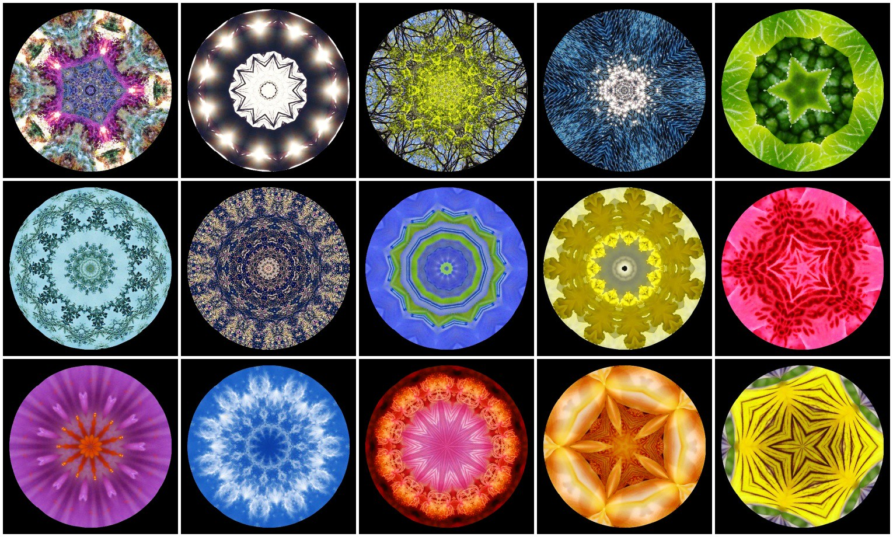

# Kaleide International School \(KIS\)


Si eres maestra/o y te ilusionaría unirte a nuestro equipo, pincha aquí: [https://jobs.kaleide.org/work-with-us/jobs](https://jobs.kaleide.org/work-with-us/jobs)



Toda la información aquí presentada es a título informativo, es susceptible de cambios y carece de valor contractual, por lo que no podemos asumir responsabilidades derivadas de esta información.


El nombre “Kaleide” es un neologismo griego derivado de las palabras καλός \(kalos\), “bello”, y εἶδος \(eidos\), “forma, figura”. Se podría decir que su significado literal es “formas bellas”, como las que caprichosamente se ordenan en el interior de un caleidoscopio para crear estructuras siempre cambiantes e inspiradoras. Es desde esta mirada que aprecia la belleza de la individualidad al mismo tiempo que la de la colectividad, como queremos acercarnos a cada una de las personas, grandes y pequeñas, que participen en nuestro espacio.

Continúa leyendo para que podamos contarte todos los detalles de este proyecto que tanto nos ilusiona.


Si después de leer esta información te quedan más dudas, escríbenos a [kaleideschool@gmail.com](mailto:kaleideschool@gmail.com) o únete a nuestro canal público de [Telegram](%20https://t.me/kaleide), donde trataremos de aclararlas.


