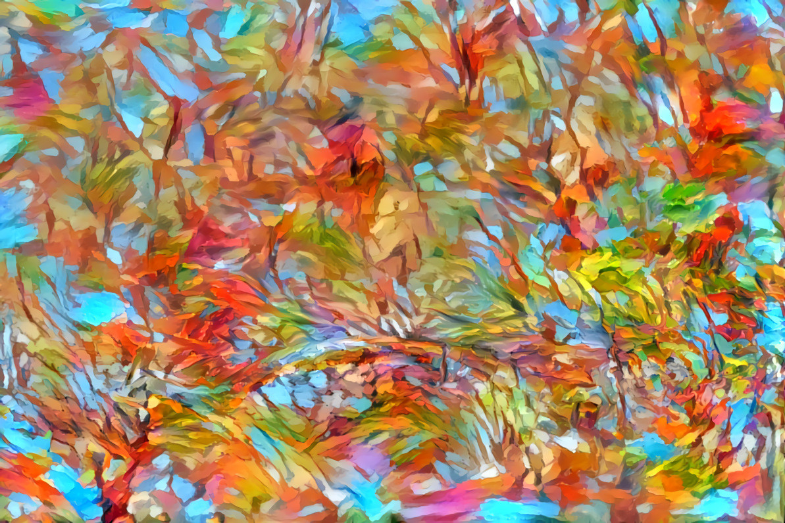

# Kaleide International School \(KIS\)

> The ultimate purpose of education is to help students and their teachers create meaning in their lives.

— Maxine Greene

## About us

Kaleide International School is to be a small co-educational day school for children aged from 3 to 12 years, based on the principles of **experiential active learning** and **democratic education**. Our name, Kaleide, takes inspiration from the Ancient Greek words καλός \(kalos\), for ‟beautiful”, and εἶδος \(eidos\), “form, shape”, which appropriately reflect the school's aim to create a beautiful and dynamic learning environment integrating diversity, creativity and the joy of learning.

**The school will open in La Laguna \(Tenerife\) in September 2020**, with an initial capacity for 26 students \(12 EYFS and 14 KS1 and KS2 students\).

Kaleide International School is the result of an extensive and ongoing seven-year research involving the theory of pedagogy, developmental psychology, and learning; study visits to over thirty innovative schools in the Netherlands, Germany, the UK, Spain, and the United States; and over one hundred video recorded interviews with teachers, experts, parents and students in those countries.

Our commitment is to incorporate this experience –as well as our passion for education– to a school that will not only bring out the best in children, but will also encourage different ways of thinking about education and childhood, in the same way that a kaleidoscope composes new and changing images of reality out of multiple reflections.

### **Our Location** 

**Kaleide International School is located in a quiet residential area of the beautiful and historic city of San Cristóbal de La Laguna, in the northern part of the island of Tenerife**. The historical centre of the city was declared a UNESCO World Heritage Site in 1999. La Laguna is the second most populated city in Tenerife after Santa Cruz, the capital, which is only 15 kilometres away. Both cities are connected by motorway and direct public transport.

**We are just a 10-minute walk from the city centre**, and close to valuable resources such as the History and Anthropology Museum, the local library, and the Museum of Science and the Cosmos. Within walking distance of the school there are public athletics, tennis and football facilities \(Estadio Francisco Peraza\), a public swimming-pool \(Complejo Deportivo San Benito\), as well as a public park \(Parque de la Vega\) with a rock climbing wall, a skate park, basketball courts, outdoor table tennis facilities and a bike motocross track. The school lies in the vicinity of Mesa Mota, a flat-topped mountain with a well-preserved macaronesian laurel forest and a picnic area. A free public car park lies in close proximity and on-street parking is available nearby.

Both the warm subtropical climate \(average of 12–19 °C in the winter and 17–24 °C in the summer\) and the beautiful natural surroundings offer invaluable opportunity to enjoy the open air all year round.

### **Our Mission**

Our mission is to create a school that values **caring relationships based on trust**, and makes heard the voices of children in all aspects of their education. Kaleide International School is a home-like setting where children will find continuity between their family, their school and the wider society; a growth-mindset-friendly community where children feel safe from judgement, respected in their own rhythms, and supported in their full potential; a learning environment which inspires wonder, curiosity, research, experimentation, problem-solving, creativity, and collaboration.

We foster children's **self-motivation** and **autonomy**, together with critical and divergent thinking, emotional awareness and competence, while nurturing their inner sense of belonging and connectedness to nature.

We entrust children with freedom to make decisions in a way that allows them to be **lifelong learners**, and **responsible, thoughtful human beings** who understand the complexity of the world around them, and have the knowledge, values, attitudes and skills to make a positive contribution.

### **Our Vision**

We will continue to approach education from a bold, innovative perspective and inspire other schools, teachers and families. We will be a school where continued improvement is informed by observation and reflection, iterative processes involving families, educators and children, and scientific research.

Our vision is aligned with deep social, economic and environmental changes –such as open source software, open culture, and democratisation of knowledge– which are impacting on the way we see education and which animate our values:

Enquiry, reasoning and critical thinking have become essential tools to navigate the Information Age and should underpin our view of **learning as a passionate, hands-on, and freely rhythmed process**.

Skills such as emotional intelligence, communication and collaboration are not only indispensable in a sharing economy but must also contribute to a more democratic and humane vision of education that values **agency, active responsibility and social engagement**.

An increasingly technologised milieu can become a valuable aid in children's learning, but **we must acknowledge and prioritise nature and the outdoors as the prime environment in promoting confidence, resilience and physical and emotional health**. Moreover, without a deep attachment to nature, the young will not be able –or willing– to protect it.

Through our commitment to these values, and by strengthening our connections with organisations and individuals working on educational, social, and environmental issues, Kaleide International School is determined to create a positive impact on the lives of children and their families, as well as in the wider community and the natural environment.

### **Our Pedagogical Approach**

It is our belief that pedagogical approaches must take account of the way in which children learn and develop as social beings. They must respond to the social, emotional, and individual needs of children, and must be flexible enough to allow children to move at a pace and in a way that preserves their innate curiosity and sense of wonder, which are the basis for lifelong ****learning.

\*\*\*\*

 ****

[Kaleidoscope Mosaic](https://www.flickr.com/photos/ladybugsleaf/107616898/in/photolist-avyKL-a4Z1FL-9gh9EA-V1Qtr4-NnPhA8-692Ytf-GYjgw-pTqQj-crPNY5-pTqMw-CMzJSu-EY5EqL-dvSQbv-JKRfG-dS1ez6-7Fxefb-4uba3W-4M6aXm-2x3jNL-eFuvv3-e3YTqk-2R6UB8-bBYRCa-e5fXnt-66u4Mt-7P9fRJ-cpMxiW-9Y5EYi-tHg5f7-Ejggf-2RbUbC-eFoEPD-7DA5tP-2RbK13-eFonSe-2R79SR-2RbLzj-eFunpE-2RbCSG-eFuLBU-9v2GKy-eFux3S-eFujsj-eFoHm8-5RCvV1-eFukY3-9v11tP-eFutmf-46L1yn-eFog8D), by Lisa Ruokis \([CC BY 2.0](https://creativecommons.org/licenses/by/2.0/)\)

As educators, **our aim is to give students the opportunity to learn in a purposeful way, and to encourage enquiry learning in organic or meaningful contexts**. Care and education form a unity in our approach, as education is built on caring interactions with other children and adults. At Kaleide International School, this caring bond will ultimately encompass the world of ideas, the human-made world and the natural world.

We want to encourage children to explore ideas about themselves and the world in which they live; to ask questions and to realise that often we need to seek answers for ourselves; to embrace diversity and ambiguity; to acquire a sense of responsibility towards themselves and others; to create meaning in their lives and, in the words of Maxine Greene, ‟to look upon the ordinary with new eyes”.

### **Our View of Children** 

Within our approach, **each child is valued as a subject of rights and a competent, curious, active learner**, continuously co-creating and testing theories about herself and the world around her. We believe children are wonderfully prepared for active learning from birth; they are self-driven and intrinsically motivated to learn at every step. For them the world is an invitation to discover. This image of the child shapes our expectations of children, and the degree of freedom and responsibility we trust them with.

### **Our View of Learning**

Essential to our approach is the understanding that **children learn through play** and through diverse interactions with adults, other children and the environment. They learn through their **curiosity**, and by attending to those things which spark their interest and their motivation. They learn through **observation, imitation, trial and error, and reflection**. They learn with their minds, but also through **all their senses and with their whole bodies**. They learn in conscious, deliberate, ways, and in ways which escape volition –but are nonetheless powerful. They learn from our words, but more importantly, from our actions.

**Learning is not a linear process**: it is complex, with stops and starts along the way, ‟a gradual ebbing and flowing of the frequencies of alternative ways of thinking”, in the words of Professor Robert Siegler. A child doesn't learn skills and concepts just once –he or she relearns them at successively more mature levels.

**We believe children learn best through active participation and experience**. When they are allowed and encouraged to follow an interest and construct a plan to learn about it, their intrinsic motivation propels them. Children learn in an integrated, creative and play-based way when the environment is rich in relationships, resources, materials, inspiration, language and support. But this is true only if children feel safe, trusted, and have the possibility to listen and be listened to, to express their differences and be receptive to the differences of others. Learning should be authentic, and not done to please others or in response to coercion.

Our approach recognises the centrality of the relationships that children have with their parents, and the teachers \(or “facilitators”\) in the school. **We believe family and community links should be strengthened and nurtured**. At Kaleide International School, parents are encouraged to be a part of their children's learning. Learning, as an integral and enjoyable part of life, should be modelled by the adults at the school: facilitators, parents and visitors. **But learning is not only based on interaction between adults and children: it is also built upon what children learn from each other**.

We acknowledge that Education can happen throughout the school and that the classroom is only one of the many environments that offers the opportunity to learn. For this reason, **every learning environment in the school is designed from a multiple-intelligences perspective**, in order to promote a wide range of challenges, interactions, and self-motivated, hands-on experiential learning with real-world connection. We believe the potential for learning is maximised if we use the powerful combination of physical, visual and naturalistic ways of learning as well as our linguistic and mathematical intelligence.

Integrating all these forms of cognition is crucial to engage children in meaningful, deep-level learning. Our approach allows children's curiosity and intrinsic motivation to flourish, and values autonomy as the key to active learning through exploration, discovery and creation.

