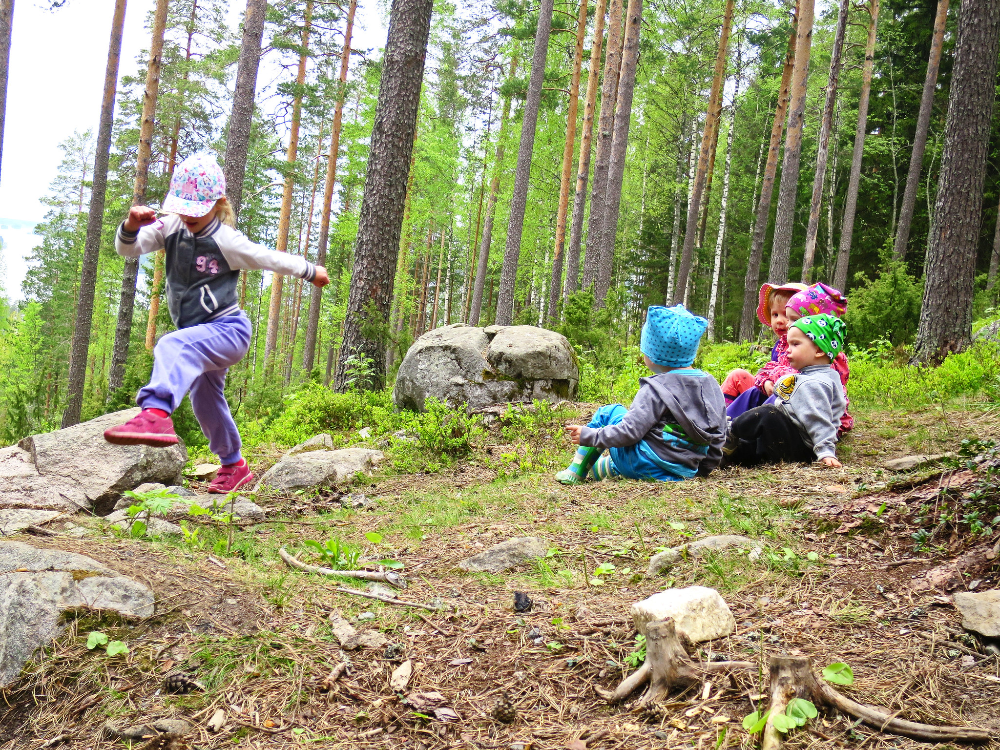

# Welcome to Kaleide International School


Admissions open for the 2020-21 school year.


### Nature-based Active Learning

**Kaleide International School is to be a small co-educational day school for children aged from 3 to 12 years, based on the principles of experiential active learning and democratic education.** Our name, Kaleide, takes inspiration from the Ancient Greek words καλός \(kalos\), for ‟beautiful”, and εἶδος \(eidos\), “form, shape”, which appropriately reflect the school's aim to create a beautiful and dynamic learning environment integrating diversity, creativity and the joy of learning.

At Kaleide, children will be able to decide how to spend their time, and their opinion will be valued and acted on in all matters which affect them; they will learn through free play, autonomy, creativity and connection to nature, within a community which is based on caring relationships and empathy. **Kaleide isn’t just an alternative school: it is a project which seeks to inspire deep changes in education, and in society at large.**

**The school will open in La Laguna \(Tenerife\) in October 2020, with an initial capacity for 26 students \(12 EYFS/preschool and 14 KS1-KS2/primary students\), which we hope to expand into Secondary Education in the near future.**

Kaleide International School is the result of an extensive and ongoing [seven-year research](www.estonoesunaescuela.org) involving the theory of pedagogy, developmental psychology, and learning; study visits to over thirty innovative schools in the Netherlands, Germany, the UK, Spain, and the United States; and over one hundred video recorded interviews with teachers, experts, parents and students in those countries.

Our commitment is to incorporate this experience –as well as our passion for education– to a school that will not only allow children the time and space they need to develop, but will also encourage different ways of thinking about education and childhood, in the same way that a kaleidoscope composes new and changing images of reality out of multiple reflections.

> The ultimate purpose of education is to help students and their teachers create meaning in their lives.

— Maxine Greene


 Email us at kaleideschool@gmail.com with any questions you may have after browsing this website.



If you're interested in joining our motivated pedagogical team, please go to jobs.kaleide.org



We use our own cookies and those of third parties for analytic purposes. If you continue browsing, we will consider that you accept them. For more information see our Cookie Policy.


### \*\*\*\*

