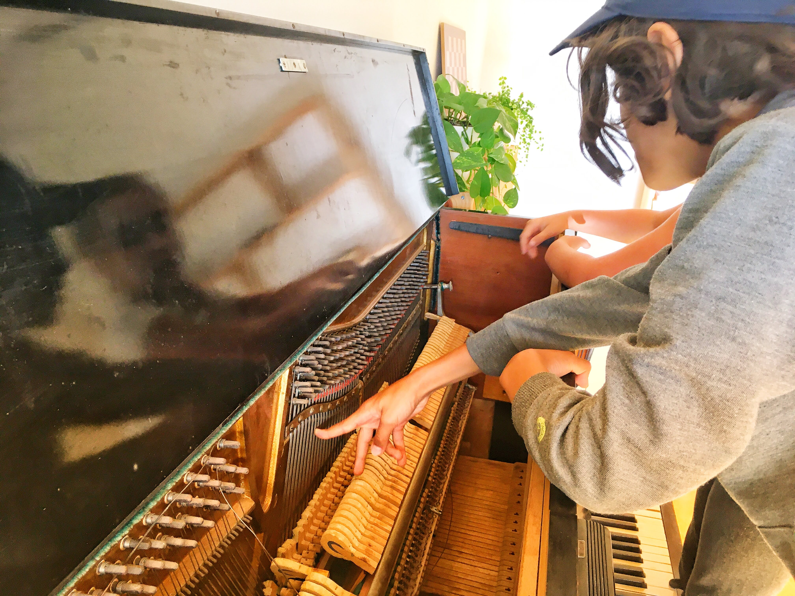

# Educational Philosophy


Within our approach, **each child is valued as a subject of rights and a competent, curious, active learner, continuously co-creating and testing theories about herself and the world around her**.&#x20;


We believe children are wonderfully prepared for active learning from birth; they are self-driven and intrinsically motivated to learn at every step. For them the world is an invitation to discover. This image of the child shapes our expectations of children, and the degree of freedom and responsibility we trust them with.

Kaleide will strive to be a place where:

* **caring and trust** are valued as the basis of all relationships;
* **children's voices are listened to and acted on;**
* **children will find continuity between their family, their school and the wider society;**
* there is **no judgment,** no rewards or punishments;
* every child's **individual rhythms are respected**;
* we can find **inspiration for wonder, curiosity, research, experimentation, problem-solving, creativity and collaboration**;
* we find ways to develop **intrinsic motivation and autonomy**, together with **divergent thinking, emotional awareness and the development of competencies**;&#x20;
* children's **connection to nature** is nourished;
* **freedom and responsibility** are encouraged and children take an active role in decision-making.

Care and education form a unity in our approach, as **education is built on caring interactions with other children and adults.** At Kaleide International School, this caring bond will ultimately encompass the world of ideas, the human-made world and the natural (or More-Than-Human) world.

Although we follow the British curriculum in terms of contents, for us the curriculum is not just what children learn but –more importantly– how they learn it. At Kaleide we work through an "emergent curriculum" which takes the children's interests and motivations as the starting point.

Our children can take part in a diverse range of activities such as:

* **trans-curricular project-based learning**;
* **hands-on workshops** (by our facilitators, experts or children themselves);
* **lessons** by facilitators;
* **outdoor learning activities** (outings to the surrounding nature, cultural visits to La Laguna);

At Kaleide **each child can design his or her own educational journey**, working together with our facilitators, choosing and proposing activities to suit his or her motivations, abilities and level of development.

We acknowledge that education can happen throughout the school and that the classroom is only one of the many environments that offers the opportunity to learn. For this reason, **every learning environment in the school is designed from a multiple-intelligences perspective**, in order to promote a wide range of challenges, interactions, and self-motivated, hands-on experiential learning with real-world connection. We believe the potential for learning is maximised if we use the powerful combination of physical, visual and naturalistic ways of learning as well as our linguistic and mathematical intelligence.

Integrating all these forms of cognition is crucial to engage children in meaningful, deep-level learning. **Our approach allows children's curiosity and intrinsic motivation to flourish, and values autonomy as the key to active learning through exploration, discovery and creation.**\

<figure><figcaption></figcaption></figure>

<figure><figcaption></figcaption></figure>
