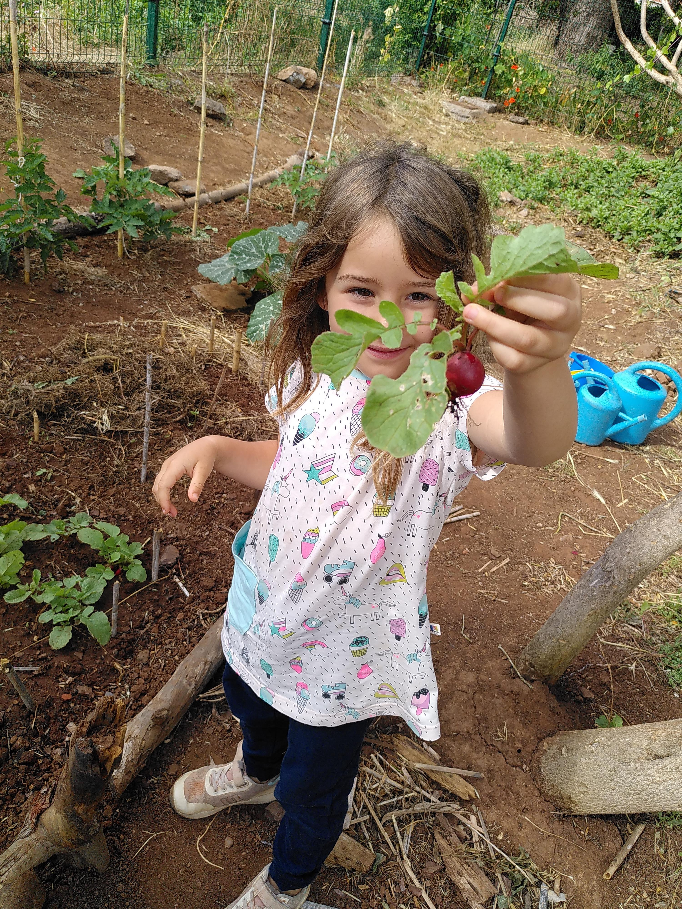

# A Bilingual School


At Kaleide, Spanish learning is experiential and takes place in the context of authentic communication during everyday activities.


Kaleide International School is a bilingual English-Spanish school. Our students learn both languages organically, through natural communication. We have a trained and multilingual team that enables our students to learn languages through play and joy.

<figure><figcaption></figcaption></figure>
