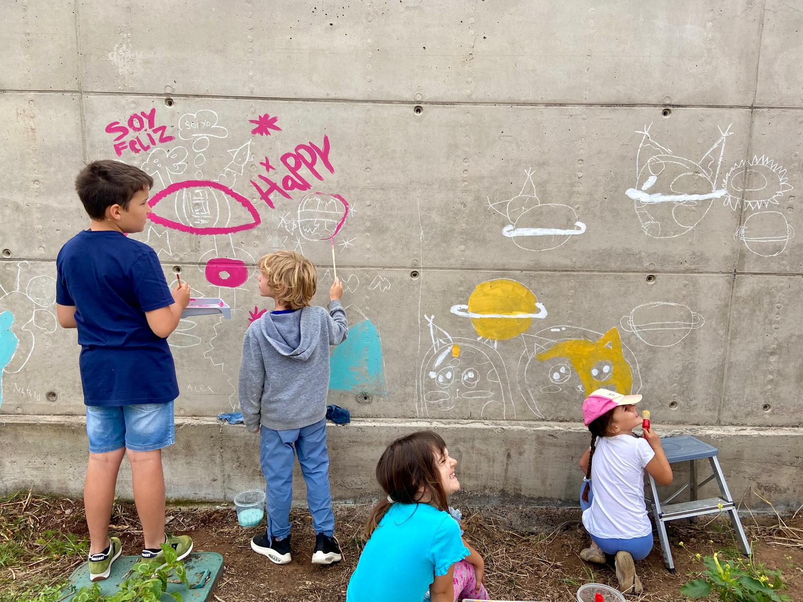

# Active Learning

At Kaleide International School we believe that children learn best when they participate actively and meaningfully in their own learning process.

**Learning through curiosity and experience**\
Our active education approach is based on play, exploration, and interactions with adults, peers, and the natural environment. Students learn through their curiosity and motivation—observing, imitating, experimenting, and reflecting. They learn with their minds, their bodies, and all their senses.

**A living, non-linear process**\
Learning is not linear: it is a complex process, with advances and pauses, enriched at every stage of development. That is why it is vital to respect individual rhythms.

**Intrinsic motivation and learning through responsible freedom**\
At our international school in Tenerife, we encourage students to follow their interests and learn to organize their own process of personal inquiry. Intrinsic motivation is the driving force behind their learning—not obligation nor the desire to please an adult.\
The projects we develop in Elementary arise from the students’ own interests, branching out as we nurture their questions and their desire to discover the world around them.

**Mixed ages**\
At Kaleide, learning is inseparable from life. Students learn from one another, without age barriers, in an environment that fosters cooperation and creativity.

**Relationships, community, and trust**\
We strengthen play-based learning through an environment rich in relationships, materials, languages, and inspiration. At Kaleide, we know that children learn best when they feel safe and when they have the freedom to express themselves knowing their voice matters. Families are part of their children’s learning, sharing time at school and growing together.

<figure><figcaption></figcaption></figure>
