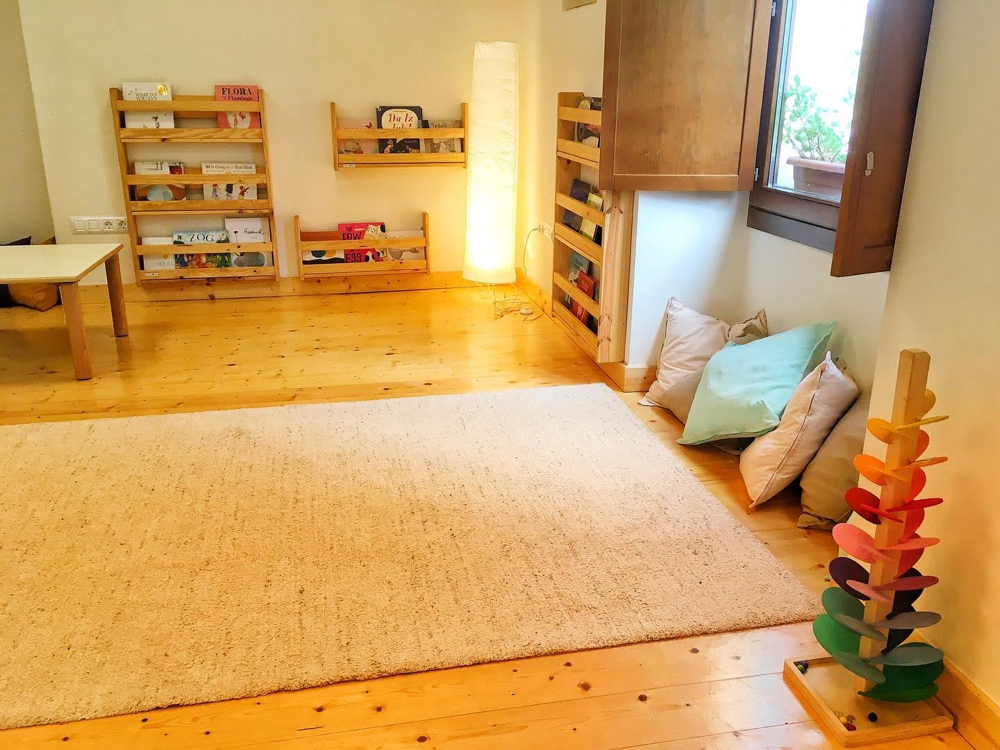
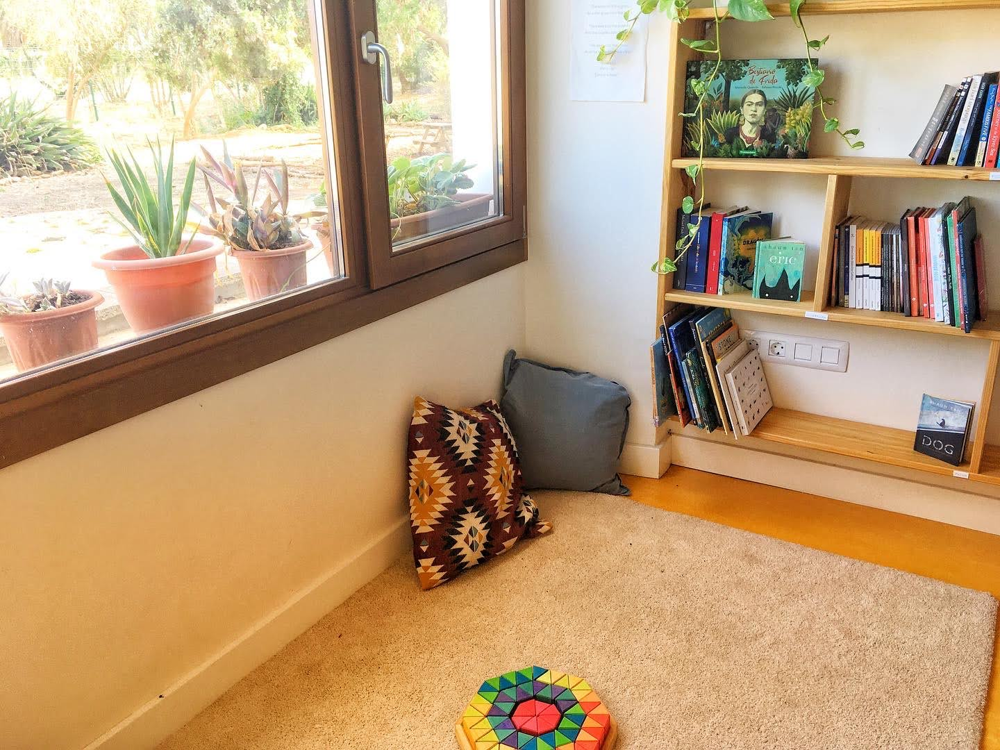
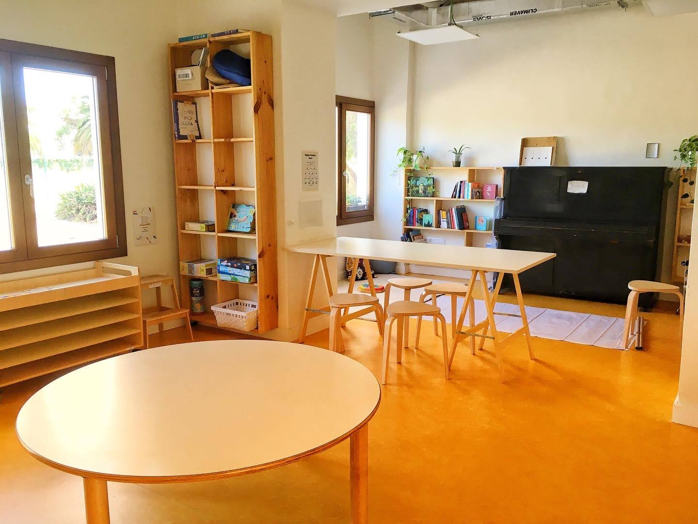
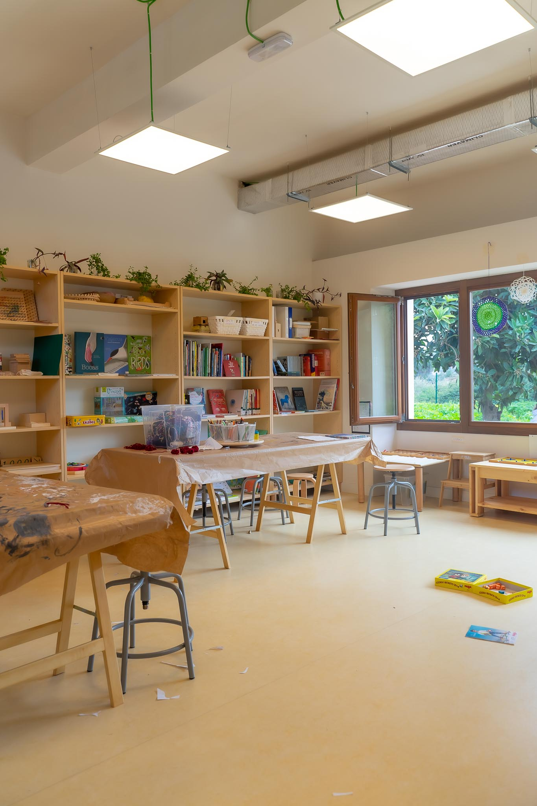
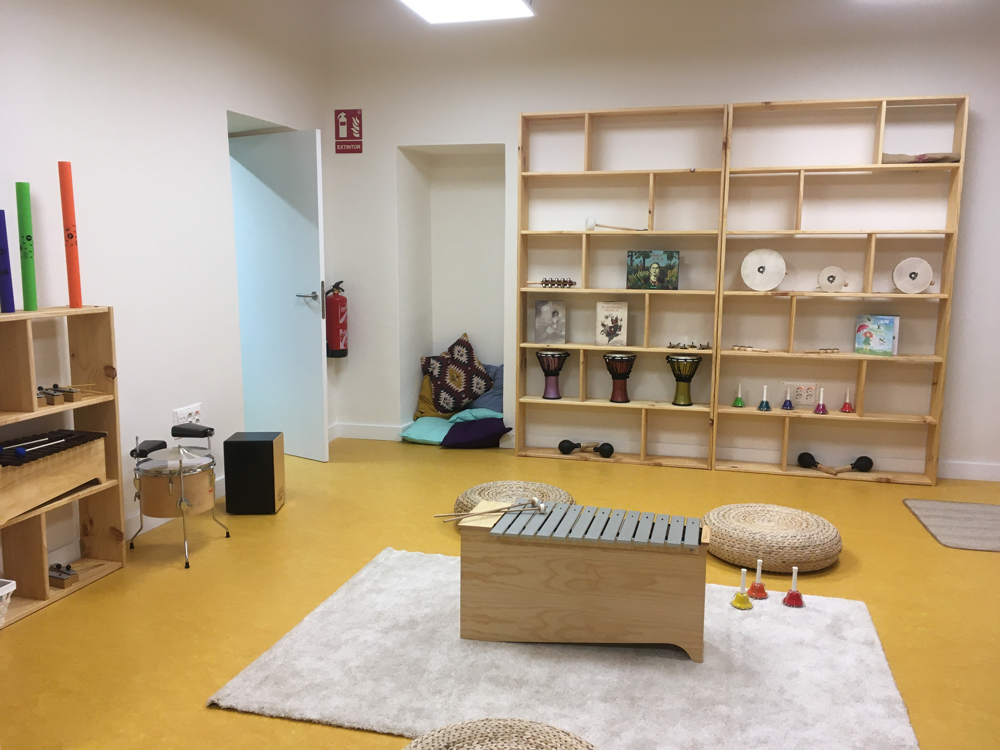
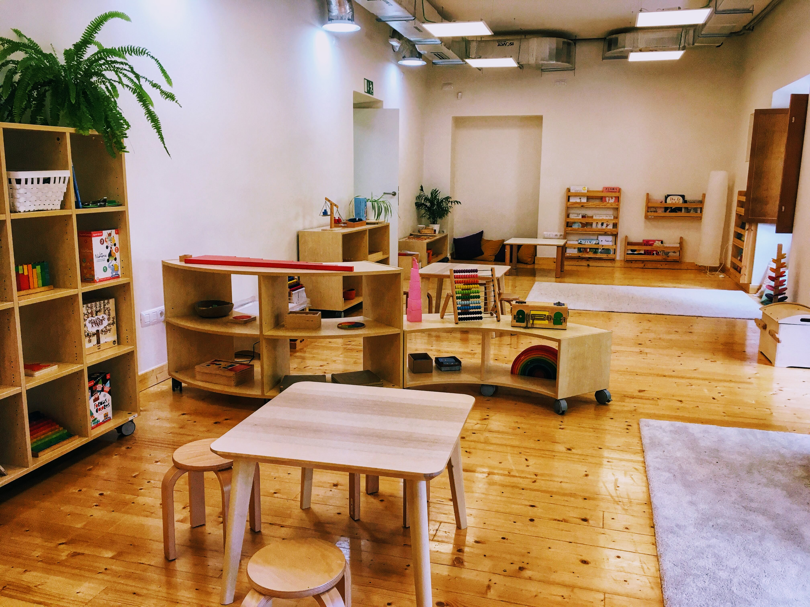

# Our Location and Facilities

**Kaleide International School is located in a quiet residential area of the beautiful and historic city of San Cristóbal de La Laguna, in the northern part of the island of Tenerife**. The historical centre of the city was declared a UNESCO World Heritage Site in 1999. La Laguna is the second most populated city in Tenerife after Santa Cruz, the capital, which is only 15 kilometres away. Both cities are connected by motorway and direct public transport.


**The school occupies a two-storey 660 m² renovated building, surrounded by 2700 m² of gardens.**&#x20;


**We are just a 10-minute walk from the city centre**, and close to valuable resources such as the History and Anthropology Museum, the local library, and the Museum of Science and the Cosmos. Within walking distance of the school there are public athletics, tennis and football facilities (Estadio Francisco Peraza), a public swimming-pool (Complejo Deportivo San Benito), as well as a public park (Parque de la Vega) with a rock climbing wall, a skate park, basketball courts, outdoor table tennis facilities and a bike motocross track. The school lies in the vicinity of Mesa Mota, a flat-topped mountain with a well-preserved macaronesian laurel forest and a picnic area. A free public car park lies in close proximity and on-street parking is available nearby.

Both the warm subtropical climate (average of 12–19 °C in the winter and 17–24 °C in the summer) and the beautiful natural surroundings offer invaluable opportunity to enjoy the open air all year round.



Inside the building there are differentiated environments and dedicated spaces for physical, musical and plastic expression, creativity, cooking and experimentation.&#x20;

The materials we use are both unstructured (loose parts) and Montessori and Waldorf, since our approach promotes hands-on learning based on experimentation.

<figure><figcaption>
A space to feel calm, safe and cared for.
</figcaption></figure>

<figure><figcaption>
All our indoor learning spaces have windows overlooking the gardens.
</figcaption></figure>

<figure><figcaption>
Our spaces can be easily converted to suit our changing needs.
</figcaption></figure>

<figure><figcaption>
Fractal, a space to explore the world around us.
</figcaption></figure>

 

<figure><figcaption>
Spiral, our coziest space.
</figcaption></figure>

