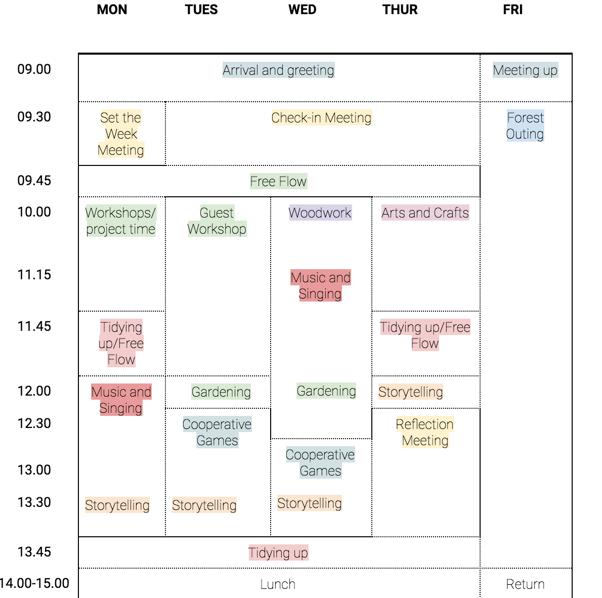
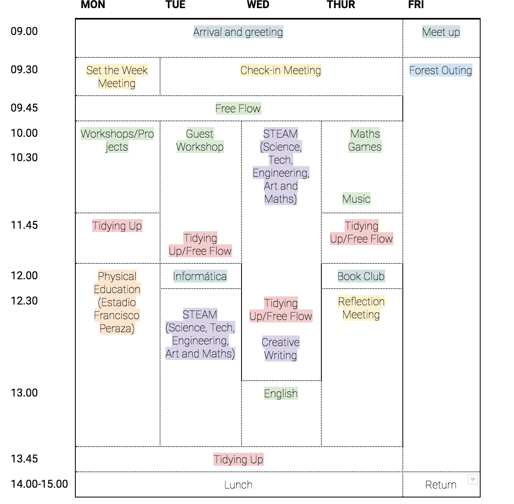

# Timetable

The school is open from **9.00 to 2.00, Monday to Friday**. Children can stay at the school for lunch, from 2.00 to 3.00 \(during our first year this is included in the school fees, but children need to bring their lunch from home or arrange with the school to have a catering meal which is paid separately\). 

For parents who need to drop off their children earlier, or pick them up later, we offer before school care as of 8.30, and after care from 3.00 to 3.30. 

#### Relaxed entry

Having a "relaxed entry" means we allow children to arrive at the school during an extended period of time, thus reducing stress and hurry for families.

Our doors open for a first entry period from 9.00 to 9:25, so that parents can come into the school and spend some minutes with their children if they wish. We shall open our doors again between 9.50 and 10.00.











