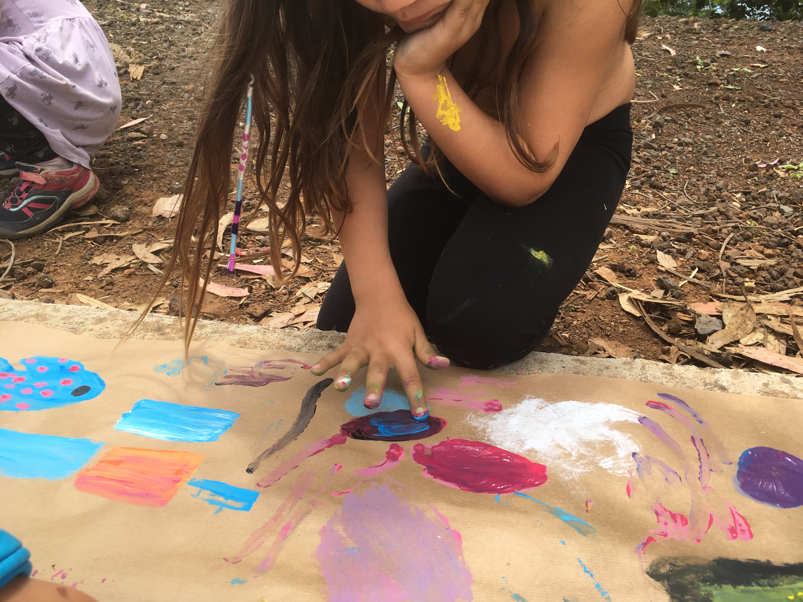
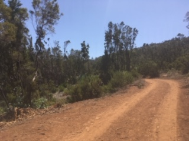

# Talleres infantiles \| verano 2021

**El 24 de junio comienza la segunda edición de nuestros campamentos de verano**, abiertos a mentes inquietas de 3 a 12 años de edad. Nuestras facilitadoras \(maestras tituladas con experiencia en educación activa\) estarán al cuidado de la propuesta, que se desarrollará de lunes a viernes en horario de 8:30 a 15:00, hasta el 30 de julio. 

**La ratio será siempre, como máximo, de 8 niñas/os por cada persona adulta.**


Para inscribirte, por favor rellena el [formulario de inscripción](https://docs.google.com/forms/d/e/1FAIpQLSc40F1ZH87-5l9027sS50HJMuBxqjVzsovuffph_dRGtfrN7A/viewform?usp=sf_link).


## Actividades y filosofía

Las actividades que proponemos tienen como base el **respeto de los ritmos individuales y motivaciones** de cada niño y niña, y están orientadas a favorecer el **aprendizaje socioemocional**, así como el **desarrollo psicomotor, la autonomía, la creatividad, el juego y la colaboración**. Algunas de las posibilidades que ofrecemos son:

observación de flora y fauna local

* cuentacuentos
* _land art_ \(arte efímero en la naturaleza\)
* juegos colaborativos
* pintura al aire libre
* creación con elementos de la naturaleza y "piezas sueltas"

## Ubicación

Nos encontraremos cada mañana en nuestras instalaciones en La Laguna, muy cerca del Estadio Francisco Peraza \("La Manzanilla"\). Es posible también que en ocasiones nos dirijamos a Mesa Mota, en función de lo que el grupo tenga interés por hacer. 

{% embed url="https://www.google.com/maps/d/u/0/viewer?mid=1XOztYHnPHX5yWgs-mnfy4eyjUDIXh4I0&ll=28.496312000000003%2C-16.323306300000002&z=16" caption="Ubicación de Kaleide International School" %}

## Precios

**El precio del campamento es de 20€ por días sueltos o 95€ por semana \(más 7% de IGIC\), en horario de 9 a 13:30. La permanencia \(de 8:30 a 15:00\), tiene un coste adicional de 20€ por semana o 5€ por día.**

El desayuno y el almuerzo deben traerse de casa. Los días de asistencia se abonarán por adelantado y no son reembolsables en caso de no asistir.

## Qué es importante traer

Es importante que cada niño o niña traiga diariamente:

* un almuerzo rico y nutritivo 
* snacks abundantes \(fruta, frutos secos, pan integral, barritas de cereales, etc.\)
* una botella de agua que pueda rellenarse \(por favor evita los envases plásticos de usar y tirar\)
* calzado cerrado \(para evitar que se les metan piedrecitas o tierra dentro\)
* ropa cómoda que pueda ensuciarse sin problema
* una muda extra para peques de 3 a 5 años
* protección solar
* gorro
* mascarilla \(solo a partir de los seis años; aunque no la usaremos dentro del grupo mientras permanezcamos al aire libre, sí lo haremos durante la llegada y la salida y cuando nos crucemos con otras personas que no formen parte del grupo\).

## Medidas de seguridad e higiene

Cada facilitadora contará con un kit con gel hidroalcohólico, un pulverizador con agua jabonosa cuando estemos fuera de nuestras instalaciones. **También tendremos siempre a mano un botiquín y bolsas para disponer de los residuos de forma separada.**

Hemos suscrito un **seguro de responsabilidad civil y de accidentes**, y nuestras facilitadoras tienen el curso de primeros auxilios de la Cruz Roja. 

En relación con las medidas de prevención de la COVID-19, para las familias que participen será imprescindible haber leído y aceptado el [protocolo elaborado por Kaleide Educación Activa](protocolo-para-la-prevencion-de-la-covid-19.md) y que se aplicará durante los campamentos de verano.


Para inscribirte, por favor rellena el [formulario de inscripción](https://docs.google.com/forms/d/e/1FAIpQLSc40F1ZH87-5l9027sS50HJMuBxqjVzsovuffph_dRGtfrN7A/viewform?usp=sf_link).


