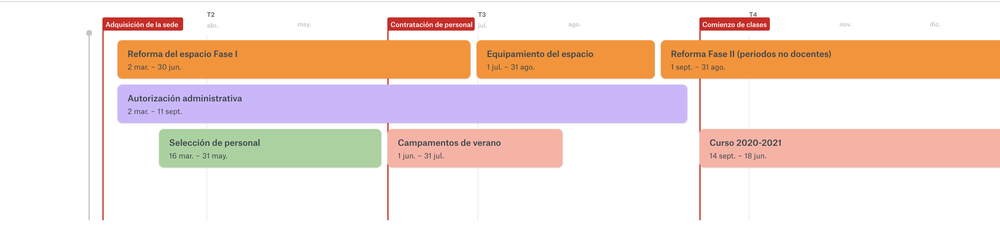

# Hoja de ruta

**Nuestro proyecto es de nueva implantación**. De alguna forma, quienes participen este primer año van a conocer y acompañar durante sus primeros pasos a una criatura recién nacida. Iniciaremos la actividad docente en octubre de 2020, previa adecuación del espacio para atender los requisitos obligatorios de seguridad, salubridad, habitabilidad y accesibilidad \(Fase I de la intervención\), y al mismo tiempo obtener todas las autorizaciones de las administraciones locales y de la Consejería de Educación del Gobierno de Canarias.

Para facilitar la convivencia de grandes, pequeños, familias y docentes **durante este primer curso** escolar \(2020-2021\) **hemos decidido reducir la capacidad efectiva del centro** a un máximo de **12 alumnos de infantil y de 14 en primaria**. Esto nos permitirá atender, de forma mucho más personalizada y a escala más humana, todas las cuestiones que se vayan planteando durante este primer año, al mismo tiempo que consolidamos un equipo de trabajo y un grupo de familias, y se van creando de forma orgánica estructuras relacionales sostenibles. Durante este primer curso sólo ocuparemos la primera planta del edificio.

Para el curso 2021-2022 se terminarán las obras de adecuación de todo el edificio \(Fase II\) y ocuparemos su totalidad, disponiendo de más espacios y materiales, además de más capacidad de alumnado. En función de la demanda para estudios de secundaria que se hubiese generado durante el curso anterior, podríamos plantear la opción de ofrecer secundaria ese mismo curso o bien esperar al año siguiente para hacerlo.


Es nuestra firme voluntad cumplir con las fechas y plazos indicados, aunque no nos es posible garantizarlos al depender muchos de ellos de terceras partes sobre las que no tenemos control.


