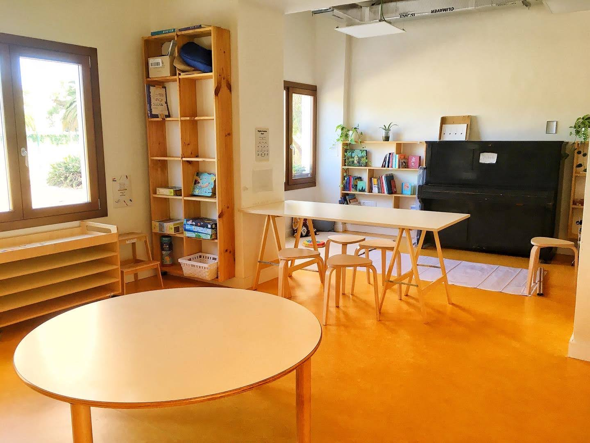

# Ubicación e instalaciones

Contamos con una **parcela en propiedad** de casi 3000 m2 de superficie sin desniveles, ubicada en una tranquila zona residencial de **San Cristóbal de La Laguna**. A escasos metros del estadio Francisco Peraza, y apenas a 15’ caminando el centro histórico de La Laguna, ciudad Patrimonio Histórico de la Humanidad. A 30’ de caminata se alcanzan algunos bosques locales de flora autóctona, y alrededor de la finca todavía existen espacios rurales y de cultivo. El 80% de la parcela es espacio libre en exterior, uno de los ambientes de aprendizaje más importantes, sobre todo a edades tempranas. De forma progresiva iremos complementando la vegetación existente con más plantas y árboles adecuados a las características de la vega lagunera.



**Nuestras instalaciones suman** entre sus dos plantas **cerca de 650 m2.** Durante la reforma integral del edificio, que se realizará en dos fases, se cuidará el carácter sostenible de las intervenciones. Aspiramos a reducir el impacto ambiental del funcionamiento del edificio mediante el reciclado de aguas grises, la depuración de aguas negras mediante plantas, la captación de agua de lluvia, el reciclado de residuos y el uso de energías renovables para su abastecimiento.

Dentro del edificio existen **ambientes diferenciados** y espacios dedicados para la expresión corporal, musical y plástica, la fabricación, la cocina y la experimentación.

Los materiales que empleamos son tanto no-estructurados (piezas sueltas) como Montessori y Waldorf, dado que nuestro enfoque promueve el aprendizaje vivencial basado en la experimentación.&#x20;

<figure><figcaption>
Spiral, un espacio para el recogimiento y el juego de fantasía.
</figcaption></figure>

<figure><figcaption></figcaption></figure>

<figure><figcaption>
Todos nuestros espacios interiores tienen ventanas que dan al jardín.
</figcaption></figure>

<figure><figcaption>
Nuestros espacios pueden transformarse para adaptarse a nuestras necesidades.
</figcaption></figure>

<figure><figcaption>
Spiral, nuestro espacio más acogedor.
</figcaption></figure>

Para aquellas actividades deportivas que no puedan realizarse en nuestro espacio, aspiramos a establecer un convenio con el Organismo Autónomo de Deportes de La Laguna que nos permita el **uso de las instalaciones deportivas cercanas**, tales como las del estadio Francisco Peraza, las del Complejo deportivo de San Benito o la pista BTT y rocódromo del parque de La Vega.

**Nos encontrarás en Camino Fuente Cañizares 11, La Laguna (Tenerife).**


Kaleide cuenta con una **localización estable**, instalaciones **accesibles y seguras**, y además promueve un **modelo de gestión y movilidad sostenible**, minimizando su impacto ambiental.

