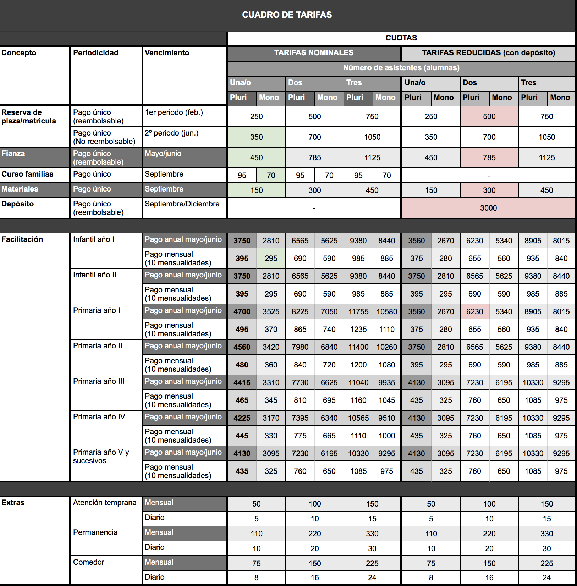

# Precios


Las condiciones económicas para quienes se unan al proyecto durante su primer año de funcionamiento son más ventajosas que en años sucesivos. 


Nuestra política de precios incluye varios conceptos. Aquí tienes una **descripción de los conceptos fundamentales** para que no te pierdas al leer la tabla que adjuntamos más abajo:




Los depósitos solo será posible suscribirlos durante el primer año de funcionamiento de KIS.



Los depósitos no son obligatorios, sino **voluntarios y reembolsables**, pero **sirven para reducir la cuota**.


Este año ofrecemos la posibilidad de realizar una aportación única por familia, reembolsable, y por un importe de **3000 €**. A cambio, te ofrecemos una reducción de las cuotas de facilitación. Este importe se **devuelve transcurrido un plazo mínimo de tres años**, consolidando a partir de ese momento los descuentos recibidos y garantizando la congelación de las cuotas para los años siguientes, salvo la corrección debida al IPC. 

El depósito **se puede recuperar antes de que se cumplan los tres años**, pero entonces **se perderán los descuentos acumulados** que se restarán del importe del depósito en su devolución, perdiendo también la posibilidad de congelar las tarifas posteriores.

 El plazo para aportar el depósito comienza el 1 de septiembre de 2020, y se deberá haber aportado un 50% del importe antes del comienzo de las clases. Para el día 18 de diciembre de 2020 se deberá haber haber completado el 100% del depósito.


**El descuento** que se obtiene ****en las cuotas de facilitación por realizar un depósito **supera al** **rendimiento del mismo importe en una cuenta corriente** a la vista.





Si realizas la matriculación en el primer periodo no pones en riesgo tu dinero, ya que sólo tendrás que acudir a la visita que concertemos antes del verano para poder solicitar su devolución, si es que no quieres continuar en el proyecto.


Este importe **solo se abona una vez por cada alumno**, en concepto de apertura de expediente y proceso de admisión al centro. En caso de que el alumno curse baja en el centro y vuelva a cursar alta transcurrido más de un curso académico completo, se deberá volver a abonar este concepto. 

Existen dos periodos para realizar la primera matriculación:

* **Primer periodo**: Entre finales de febrero y la primera semana de marzo. El importe es de 250 € y es reembolsable. Antes del verano \(mayo-junio\) se realizará una visita a las instalaciones y se facilitará información detallada sobre el cumplimiento de la hoja de ruta, el personal contratado, etc. En ese momento se ofrecerá la posibilidad de continuar en el proyecto o no. En caso de no querer continuar, se devolverá el importe íntegro de la matrícula.
* **Segundo periodo**: Antes del verano \(mayo-junio\), por un importe de 350 € y sin posibilidad de reembolso.




Los gastos de materiales se desgravan del I.R.P.F. por un importe anual de hasta 100 €.


Esta cuota anual sirve para cubrir los gastos de materiales y consumibles de las actividades pedagógicas. El importe estimado inicialmente es de 150 € por niño, y está sujeto a revisión anual. Si a la finalización del curso escolar se rebasara esta previsión, sería necesario complementar el importe.




En caso de que se haya realizado un depósito, el curso es gratuito.


Todas las familias que acudan a KIS por primera vez, deben hacer un curso de formación para adultos. En el se les explicará en detalle todo lo relativo a:

* las normas básicas de permanencia en el centro;
* las actitudes y estrategias relacionales con el personal y el resto de participantes \(niñas y niños\);
* las cuestiones básicas de seguridad y autoprotección;
* las políticas del centro \(resolución de conflictos, antibullying, bienestar infantil, comunicación interna, etc.\);
* la asociación de madres y padres;
* el proyecto pedagógico y las normas de convivencia;
* etc.

Procuraremos que sea algo más parecido a una fiesta que a un aburrido curso de formación, pero es indispensable que las familias pasen por este proceso. El curso de formación lleva asociado un coste de 95 € por familia, que no es necesario abonar si se ha optado por realizar un depósito.



Como garantía de pago y para hacer frente a cualquier saldo deudor, es necesario depositar una fianza al comienzo de cada curso. **El importe varía en función del número de niños por familia**, como se puede observar en la tabla de tarifas que se incluye más abajo. 

En caso de impago de alguna cuota, se tratará con los afectados la solución a adoptar, aunque **la condición para poder seguir acudiendo al centro es no tener saldo deudor** con el mismo. La fianza se puede devolver al finalizar el curso o, si se va a continuar en el centro, dejarla en depósito para cursos posteriores, debiendo actualizar el importe si hubieran variaciones al alza del IPC.




**Las cuotas** docentes nominales \(nosotras las llamamos de "facilitación"\) **van reduciéndose** con el tiempo **conforme aumenta la antigüedad del menor en el centro.**



**En caso de haber realizado un depósito, sucede a la inversa**, las cuotas van incrementándose durante tres años hasta congelarse en el cuarto año.


Esta **es la cuota que da acceso a los servicios docentes** y, para el ciclo de primaria, tiene la peculiaridad de ser decreciente a lo largo del tiempo \(salvo en caso de haber realizado un depósito, que es a la inversa\).

Ofrecemos  dos formas de pago:

* **Pago por adelantado por el importe total:** Se bonifica con un descuento adicional del 5% sobre la tarifa anual. 
* **Pago por mensualidades:** No tiene descuento. Nuestra propuesta es realizar 10 pagos mensuales, siendo el primero a comienzos de septiembre y los posteriores al comienzo de cada mes. No obstante, podemos acordar individualmente con cada familia otras formas de pago que puedan ser más fáciles de asumir, con la única condición de no incurrir en saldos deudores.

Como se puede observar en la tabla, existen grandes diferencias entre los importes en caso de realizar un depósitos y en caso de no hacerlo.

Por último, además del descuento por pago único ya comentado más arriba, se ofrecen descuentos adicionales, acumulables, para las siguientes situaciones:

* **Descuento por hermanos:** cada hermana/o adicional verá su cuota reducida un 25%.
* **Descuento por familia monomaren\[paren\]tal:** para aquellas familias de una sola progenitora/tutora existe la posibilidad de un descuento equivalente al de hermanos desde el primer hijo. Para acceder a este descuento, es necesario demostrar también unos ingresos familiares inferiores a un umbral determinado.


En la tabla que adjuntamos más abajo, el concepto "Año I", "Año II", etc. se refiere a los años que lleva el menor en el centro, no al curso que le corresponde por edad.




Además de estos conceptos básicos, para aquellas familias que lo requieran, ofrecemos **servicios adicionales** que se abonan aparte:



Cubre la atención del menor durante media hora antes de la apertura del centro. Esta tarifa puede ser abonada de forma regular \(mensualmente\) o bien puntual, por días concretos.



Cubre la atención del menor hasta dos horas después del cierre del centro. Esta tarifa puede ser abonada de forma regular \(mensualmente\) o bien puntual, por días concretos.



**La atención a la comida está cubierta por el horario escolar**, pero no lo está la comida propiamente dicha, que puede ser traída de casa o bien adquirida en el centro mediante un servicio de catering. Se podrá abonar de forma puntual o mensual.


Los valores indicados en la tabla que se adjunta más abajo son estimativos. Todavía no contamos con presupuestos reales sobre los costes del catering.




En la [siguiente tabla](https://docs.google.com/spreadsheets/d/e/2PACX-1vSRmOhWtaJJzFCl3qo0bwqMg0u5YAaCWpOcsRq80UQ9NGAl4F8SwVyfIxNJEjLtXNwHxhsDULlkVlbi/pubhtml?gid=1755592152&single=true) se pueden observar las tarifas nominales y las tarifas aportando el depósito. En cada escenario figuran los importes correspondientes para cada uno de los conceptos arriba indicados, según el número de hermanos y según la condición de que sean dos progenitores o un único progenitor. 

A modo de ejemplo, para que se entienda mejor, se han marcado a color dos escenarios diferentes:

* **Verde:**
  * familia monomarental;
  * un solo hijo en el ciclo de infantil;
  * abona la primera matriculación en junio;
  * abona las cuotas de facilitación en 10 mensualidades**.**
* **Rojo**: 
  * familia de dos progenitores \(pluriparental\);
  * dos hijas en el ciclo de primaria;
  * realizan un depósito;
  * abonan la primera matriculación en febrero;
  * abonan de un solo pago la cuota de facilitación.


Todos los importes indicados se verán corregidos anualmente en caso de subidas del IPC.


