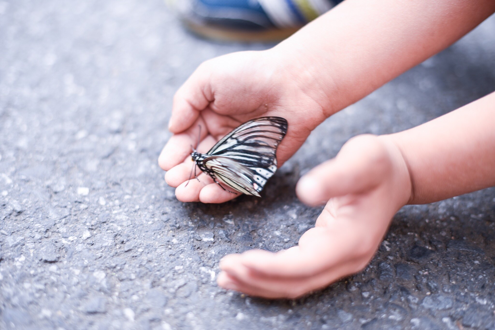

# Presentación

Kaleide International School será **una escuela** **pequeña y familiar** donde los niños y niñas encontrarán continuidad entre su familia, su escuela y la sociedad circundante; una comunidad donde los niños y niñas crecen **sin juicios**, y sienten que se respetan sus propios ritmos, y que se les apoya en el desarrollo de su pleno potencial; un entorno de aprendizaje **que inspira a los niños y niñas y cultiva el sentido del asombro, la curiosidad, la indagación, la experimentación, la solución de problemas, la creatividad y la colaboración.** 

**Queremos alentar la motivación intrínseca y la autonomía de los niños y niñas**, junto con su pensamiento crítico y divergente, su conciencia emocional y su capacidad innata para reconocer sus propias necesidades, al tiempo que nutrir su sentimiento de pertenencia y su conexión a la naturaleza. 


En abril de 2020 Kaleide International School ha sido admitida al prestigioso proceso de acreditación de la organización estadounidense NEASC \(New England Association of Schools and Colleges\) con el fin de acreditarnos como escuela extranjera.


Los promotores somos una madre y un padre \(Diana y Diego\) que llevamos ocho años explorando y divulgando formas de educar más cercanas a las necesidades de los niños y niñas. Nuestra investigación, que hemos plasmado en un [blog](http://www.estonoesunaescuela.org) y un documental que muy pronto verá la luz, nos ha llevado a visitar y conocer muchos proyectos educativos en España y en el extranjero, y a conectar con decenas de personas implicadas en un cambio educativo. En la medida de lo posible, hemos ido difundiendo nuestras reflexiones en torno a la educación a través de nuestra web, medios de comunicación y redes sociales. Tras nuestra experiencia en los mundos virtuales de las redes sociales y el audiovisual, hemos sentido la necesidad de impulsar la creación de Kaleide International School donde pretendemos condensar todos nuestros aprendizajes.

