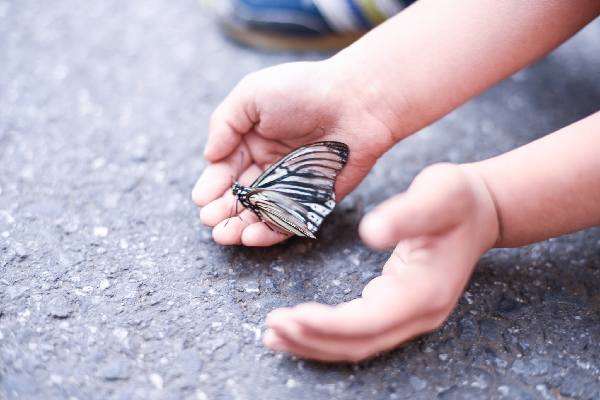

# Propuesta pedagógica

**Dentro de nuestro enfoque, cada niño y niña es valorado como sujeto de derechos, y como una persona curiosa y activa capaz de aprender y de explorar todo lo que le rodea, de co-crear y poner a prueba nuevas hipótesis sobre sí misma y sobre el mundo.** 

Creemos que los niños y niñas vienen preparados para el aprendizaje activo desde el nacimiento; rebosan motivación intrínseca y ganas de aprender a cada paso. El mundo les invita a descubrirlo. 

Vemos a los niños y niñas como personas competentes que merecen nuestra confianza, de ahí el grado de libertad y de responsabilidad que les confiamos.

Kaleide quiere ser una escuela donde:

* se valoran las **relaciones de cuidado** basadas en la confianza;
* **se escuchan** y tienen en cuenta **las voces de los niños y niñas**;
* **hay continuidad** entre la familia, la escuela y la sociedad;
* se fomenta un **entorno libre de juicio**, sin premios ni castigos;
* se respetan los **ritmos individuales** de cada niño y niña;
* se inspira el **asombro**, la **curiosidad**, la **investigación**, la **experimentación**, la **resolución de problemas**, la **creatividad** y la **colaboración**;
* se fomentan la **motivación intrínseca** y la **autonomía**, junto con el **pensamiento divergente**, la **conciencia emocional** y el **desarrollo de competencias**;
* se alimenta la **conexión** de los niños y niñas **con la naturaleza**;
* se promueve la **libertad responsable** de los niños y niños, y su **participación en la toma de decisiones.**

El cuidado y el aprendizaje forman un todo en Kaleide, porque entendemos que **la educación se construye sobre una interacción** \(entre todas las personas que formamos la comunidad educativa\) **basada en el cuidado.** Nuestro deseo es que estos lazos de cuidado se extiendan al mundo de las ideas, al mundo humano y al mundo natural.

Seguimos un currículum que está basado en el currículum británico en cuanto a contenidos. Pero **el currículum no es solo qué aprenden los niños y niñas, sino sobre todo cómo aprenden**. En Kaleide trabajamos desde un “currículum emergente” que toma la forma de aprender y las motivaciones e inquietudes de los niños y niñas como punto de partida.

En Kaleide, los niños y niñas podrán participar en diversas actividades:

* **aprendizaje interdisciplinar** basado en proyectos;
* **talleres vivenciales** \(impartidos por facilitadoras, niños o expertas\);
* **clases** impartidas por una persona adulta;
* **aprendizaje en espacios abiertos** \(jardines de la escuela, salidas al campo y la playa, visitas a la biblioteca y los museos de La Laguna\);

Cada niño y niña tendrá la **oportunidad de diseñar su propio itinerario de aprendizaje** en colaboración con el equipo pedagógico, eligiendo y proponiendo actividades que se ajusten a sus motivaciones, sus habilidades y su nivel de desarrollo.

**Queremos alentar la motivación intrínseca y la autonomía de los niños y niñas**, junto con su pensamiento crítico y divergente, su conciencia emocional y su capacidad innata para reconocer sus propias necesidades, al tiempo que nutrir su sentimiento de pertenencia y su conexión a la naturaleza. 

Confiamos en la capacidad de los niños y niñas de hacer un uso responsable de la libertad, y los incluimos siempre en la toma de decisiones. Tenemos el convencimiento de que, desde esa autonomía, podrán conservar el deseo de aprender toda su vida, desarrollar su responsabilidad y su sensibilidad, ser capaces de comprender la complejidad del mundo que los rodea y adquirir los conocimientos, los valores, las actitudes y las habilidades necesarias para hacer aportaciones constructivas.

