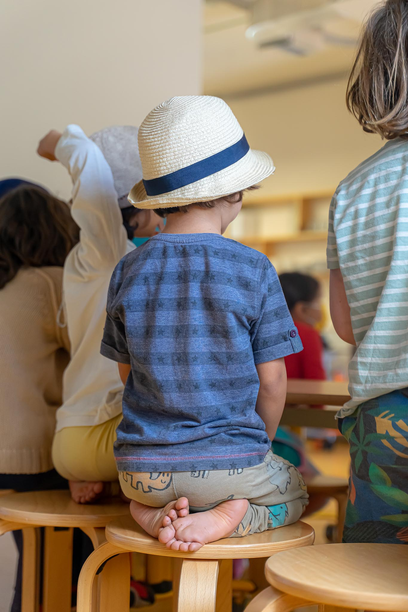

# Nuestra visión del aprendizaje

**Los niños y niñas aprenden por medio del juego y de interacciones diversas con personas adultas, con otros niños y con el entorno**. Aprenden **gracias a su curiosidad**, y prestando atención a todo aquello que despierta su interés y su motivación. Aprenden **desde la observación, la imitación, el ensayo y el error, y la reflexión**. Aprenden **con sus mentes, pero también con todos sus sentidos y con todo su cuerpo**. A veces aprenden de forma consciente y deliberada, y otras veces sus aprendizajes son inconscientes, pero no por ello dejan menos huella. **Aprenden de nuestras palabras, pero sobre todo de nuestros actos.**

**El proceso de aprendizaje no es linear**: es un proceso complejo, que se interrumpe y se reanuda a lo largo del camino, una "marea que se acerca y se aleja, compuesta por modos de pensamiento diferentes", en palabras del profesor Robert Siegler. Un niño o niña no aprende habilidades y conceptos una sola vez: los re-aprende sucesivamente en niveles de maduración cada vez más complejos.

Creemos que los niños y niñas aprenden mejor a través de la participación activa y de la experiencia; **el aprendizaje ha de surgir del propio deseo, y no estar motivado por el deseo de agradar a otras personas o por la obligación**. Cuando a los estudiantes se les permite y se les alienta a seguir sus intereses y construir un plan para investigarlos, su motivación intrínseca es el motor que los impulsa. Los niños aprenden de una manera integrada, basada en el juego, cuando el entorno es rico en relaciones, recursos, materiales, inspiración, lenguaje y apoyo. Pero esto es cierto solo cuando los niños y niñas se sienten seguros, saben que se confía en ellos, que pueden escuchar y que que se les escucha, que pueden manifestar sus discrepancias y atender a las discrepancias de otras personas.

<figure><figcaption></figcaption></figure>

**Nuestro enfoque reconoce el papel central de las relaciones que los niños y niñas tienen con sus familias, y con los educadores/as (o "facilitadores/as") de la escuela**. Creemos que los lazos con las familias deben cuidarse y alimentarse. En Kaleide queremos facilitar que las familias sean parte del aprendizaje de sus hijos e hijas, y que puedan aprender con ellos. El aprendizaje es inseparable de la vida, y las personas adultas de la escuela (facilitadores/as, familias y visitantes) han de ser un ejemplo de nuestra capacidad para disfrutar aprendiendo. **Pero el aprendizaje no surge solo de la interacción entre niños y adultos, sino que también se construye sobre lo que los niños y niñas aprenden unos de otros.** Por eso en Kaleide los niños y niñas pueden relacionarse libremente sin barreras de edad.

