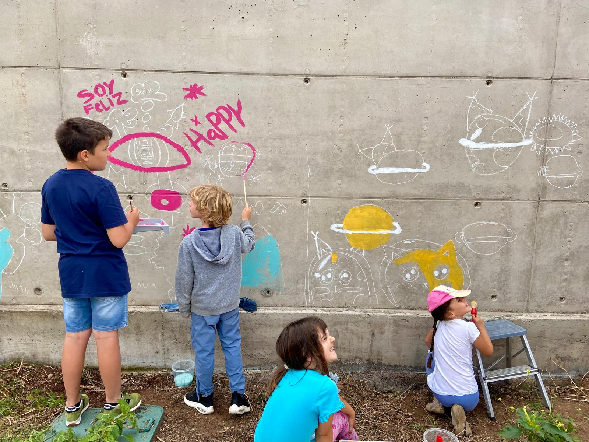

# Aprendizaje Activo en Kaleide

En **Kaleide International School** creemos que los niños y niñas aprenden mejor cuando participan de manera activa y significativa en su propio proceso de aprendizaje.

#### Aprender desde la curiosidad y la experiencia

Nuestro enfoque de **educación activa** se basa en el juego, en la exploración y en las interacciones con adultos, con otros niños y con el entorno natural. Los estudiantes aprenden gracias a su curiosidad y motivación, observando, imitando, experimentando y reflexionando. Aprenden con la mente, el cuerpo y con todos los sentidos.

#### Un proceso vivo y no lineal

El aprendizaje no es lineal: es un proceso complejo, con avances y pausas, que se enriquece en cada etapa de desarrollo. Por eso es vital **respetar los ritmos individuales.**

#### Motivación intrínseca y aprendizaje desde la libertad responsable

En nuestra **escuela internacional en Tenerife** fomentamos que los estudiantes sigan sus intereses y aprendan a organizar su proceso de investigación personal. La motivación intrínseca es la fuerza que impulsa su aprendizaje, no la obligación ni el deseo de agradar a una persona adulta.

Los proyectos que desarrollamos en Primaria surgen de los intereses propios de los estudiantes, y van ramificándose a medida que alimentamos sus preguntas y su deseo de descubrir el mundo que les rodea.

#### Mezcla de edades

En Kaleide, el aprendizaje es inseparable de la vida. Los estudiantes aprenden unos de otros, sin barreras de edad, en un ambiente que favorece la cooperación y la creatividad.

#### Relaciones, comunidad y confianza

Potenciamos el **aprendizaje basado en el juego** a través de un entorno rico en relaciones, materiales, lenguajes e inspiración. En Kaleide sabemos que los niños y niñas aprenden mejor cuando se sienten seguros, y cuando cuentan con la libertad de expresarse sabiendo que su voz importa. Las familias forman parte del aprendizaje de sus hijos e hijas, compartiendo tiempo en la escuela y creciendo juntos.

<figure><figcaption></figcaption></figure>
